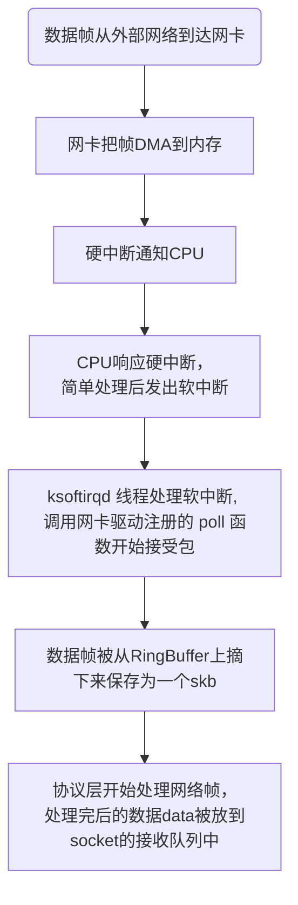

# 数据是如何从网卡到协议栈的

## Linux网络收包总览




## Linux 启动

### 创建 ksoftirqd 内核线程

`Linux` 的软中断都是在专⻔的内核线程(`ksoftirqd`)中进行


```c
//file: kernel/softirg.c
static struct smp_hotplug_thread softirq_threads = {
	.store			= &ksoftirqd,
	.thread_should_run	= ksoftirqd_should_run,
	.thread_fn		= run_ksoftirqd,
	.thread_comm		= "ksoftirqd/%u",
};

static __init int spawn_ksoftirqd(void)
{
	cpuhp_setup_state_nocalls(CPUHP_SOFTIRQ_DEAD, "softirq:dead", NULL,
				  takeover_tasklets);
	BUG_ON(smpboot_register_percpu_thread(&softirq_threads));

	return 0;
}

early_initcall(spawn_ksoftirqd);
```

当 `ksoftirqd` 被创建出来以后，它就会进入自己的线程循环函数 `ksoftirqd_should_run` 和
`run_ksoftirqd`了。

### 网络子系统初始化

`Linux` 内核通过调用 `subsys_initcall` 来初始化各个子系统, 网络子系统调用 `subsys_initcall(net_dev_init);` 来初始化，会给每个 `CPU` 都申请一个 `softnet_data` 数据结构，这个数据结构里的
`poll_list` 用于等待驱动程序将其 `poll` 函数注册进来。另外为 `NET_TX_SOFTIRQ` 和  `NET_RX_SOFTIRQ` 终端注册处理函数。


```c
//file: net/core/dev.c
static int __init net_dev_init(void)
{
	...

	/*
	 *	Initialise the packet receive queues.
	 */

	for_each_possible_cpu(i) {
		struct work_struct *flush = per_cpu_ptr(&flush_works, i);
		struct softnet_data *sd = &per_cpu(softnet_data, i);

		INIT_WORK(flush, flush_backlog);

		skb_queue_head_init(&sd->input_pkt_queue);
		skb_queue_head_init(&sd->process_queue);
#ifdef CONFIG_XFRM_OFFLOAD
		skb_queue_head_init(&sd->xfrm_backlog);
#endif
		INIT_LIST_HEAD(&sd->poll_list);
		sd->output_queue_tailp = &sd->output_queue;
#ifdef CONFIG_RPS
		INIT_CSD(&sd->csd, rps_trigger_softirq, sd);
		sd->cpu = i;
#endif
		INIT_CSD(&sd->defer_csd, trigger_rx_softirq, sd);
		spin_lock_init(&sd->defer_lock);

		init_gro_hash(&sd->backlog);
		sd->backlog.poll = process_backlog;
		sd->backlog.weight = weight_p;
	}

	...

	open_softirq(NET_TX_SOFTIRQ, net_tx_action);
	open_softirq(NET_RX_SOFTIRQ, net_rx_action);

	...
}

subsys_initcall(net_dev_init);
```
### 协议栈注册

`Linux` 内核中的 `fs_initcal` 和 `subsys_initcall` 类似，也是初
始化模块的入口。`fs_initcall` 调用 `inet_init` 开始网络协议栈注册，通过 `inet_init`， 将协议处理函数注册到 `inet_protos` 和 `ptype_base` 数据结构中，

### 网卡驱动初姶化
### 启动网卡

### 迎接数据的到来
### 硬中断处理
### ksoftirgd内核线程处理软中断


```c
// file: net/ipv4/af_inet.c
const struct proto_ops inet_stream_ops = {
	.family		   = PF_INET,
	.owner		   = THIS_MODULE,
	.bind		   = inet_bind,
	.connect	   = inet_stream_connect,
	.accept		   = inet_accept,
	.poll		   = tcp_poll,
	.listen		   = inet_listen,
	.sendmsg	   = inet_sendmsg,
	.recvmsg	   = inet_recvmsg,
    ...
};
const struct proto_ops inet_dgram_ops = {
	.family		   = PF_INET,
	.owner		   = THIS_MODULE,

    .recvmsg	   = inet_recvmsg,
    ...
}

static const struct proto_ops inet_sockraw_ops = {
    ...
};

static struct inet_protosw inetsw_array[] =
{
	{
		.type =       SOCK_STREAM,
		.protocol =   IPPROTO_TCP,
		.prot =       &tcp_prot,
		.ops =        &inet_stream_ops,
		.flags =      INET_PROTOSW_PERMANENT |
			      INET_PROTOSW_ICSK,
	},

	{
		.type =       SOCK_DGRAM,
		.protocol =   IPPROTO_UDP,
		.prot =       &udp_prot,
		.ops =        &inet_dgram_ops,
		.flags =      INET_PROTOSW_PERMANENT,
       },

       {
		.type =       SOCK_DGRAM,
		.protocol =   IPPROTO_ICMP,
		.prot =       &ping_prot,
		.ops =        &inet_sockraw_ops,
		.flags =      INET_PROTOSW_REUSE,
       },

       {
	       .type =       SOCK_RAW,
	       .protocol =   IPPROTO_IP,	/* wild card */
	       .prot =       &raw_prot,
	       .ops =        &inet_sockraw_ops,
	       .flags =      INET_PROTOSW_REUSE,
       }
};
```
```c
// file: net/ipv4/protocol.h
struct inet_protosw {
	struct list_head list;

        /* These two fields form the lookup key.  */
	unsigned short	 type;	   /* This is the 2nd argument to socket(2). */
	unsigned short	 protocol; /* This is the L4 protocol number.  */

	struct proto	 *prot; //套接口网络层接口，对应tcp_prot  udp_prot  raw_prot
	const struct proto_ops *ops; //套接口传输层接口。TCP为inet_stream_ops UDP为inet_dgram_ops 原始套接口则为inet_sockraw_ops

	unsigned char	 flags;      /* See INET_PROTOSW_* below.  */
};
```
```c
// file: net/ipv4/protocol.c

struct net_protocol __rcu *inet_protos[MAX_INET_PROTOS] __read_mostly;
EXPORT_SYMBOL(inet_protos);
const struct net_offload __rcu *inet_offloads[MAX_INET_PROTOS] __read_mostly;
EXPORT_SYMBOL(inet_offloads);

int inet_add_protocol(const struct net_protocol *prot, unsigned char protocol)
{
	return !cmpxchg((const struct net_protocol **)&inet_protos[protocol],
			NULL, prot) ? 0 : -1;
}
EXPORT_SYMBOL(inet_add_protocol);
```


//设备物理层的初始化net_dev_init
//TCP/IP协议栈初始化inet_init 其实传输层的协议初始化也在这里面
//传输层初始化proto_init  只是为了显示各种协议用的
//套接口层初始化sock_init  netfilter_init在套接口层初始化的时候也初始化了

```c
static struct packet_type ip_packet_type __read_mostly = {
	.type = cpu_to_be16(ETH_P_IP),
	.func = ip_rcv,
	.list_func = ip_list_rcv,
};

static int __init inet_init(void)
{
    ...
    (void)sock_register(&inet_family_ops);

    /*
	 *	Add all the base protocols.
	 */
    // 每种协议传输层的接收函数
	if (inet_add_protocol(&icmp_protocol, IPPROTO_ICMP) < 0)
		pr_crit("%s: Cannot add ICMP protocol\n", __func__);
	if (inet_add_protocol(&udp_protocol, IPPROTO_UDP) < 0)
		pr_crit("%s: Cannot add UDP protocol\n", __func__);
	if (inet_add_protocol(&tcp_protocol, IPPROTO_TCP) < 0)
		pr_crit("%s: Cannot add TCP protocol\n", __func__);
#ifdef CONFIG_IP_MULTICAST
	if (inet_add_protocol(&igmp_protocol, IPPROTO_IGMP) < 0)
		pr_crit("%s: Cannot add IGMP protocol\n", __func__);
#endif

	/* Register the socket-side information for inet_create. */
    // 套接口层的相关函数
    // 把inetsw_array结构中的节点添加到inetsw表中，以type为索引
	for (r = &inetsw[0]; r < &inetsw[SOCK_MAX]; ++r)
		INIT_LIST_HEAD(r);

	for (q = inetsw_array; q < &inetsw_array[INETSW_ARRAY_LEN]; ++q)
		inet_register_protosw(q);

    ...

    dev_add_pack(&ip_packet_type);
}
```


```c
/*
搜一下内核源代码，二层协议还真是多。。。
drivers/net/wan/hdlc.c: dev_add_pack(&hdlc_packet_type);  //ETH_P_HDLC    hdlc_rcv
drivers/net/wan/lapbether.c:
            dev_add_pack(&lapbeth_packet_type);         //ETH_P_DEC       lapbeth_rcv
drivers/net/wan/syncppp.c:
            dev_add_pack(&sppp_packet_type);            //ETH_P_WAN_PPP   sppp_rcv
drivers/net/bonding/bond_alb.c:  dev_add_pack(pk_type); //ETH_P_ARP       rlb_arp_recv
drivers/net/bonding/bond_main.c:dev_add_pack(pk_type);  //PKT_TYPE_LACPDU bond_3ad_lacpdu_recv
drivers/net/bonding/bond_main.c:dev_add_pack(pt);       //ETH_P_ARP       bond_arp_rcv
drivers/net/pppoe.c: dev_add_pack(&pppoes_ptype);       //ETH_P_PPP_SES   pppoe_rcv
drivers/net/pppoe.c: dev_add_pack(&pppoed_ptype);       //ETH_P_PPP_DISC  pppoe_disc_rcv
drivers/net/hamradio/bpqether.c:
                    dev_add_pack(&bpq_packet_type);     //ETH_P_BPQ       bpq_rcv
net/ipv4/af_inet.c:  dev_add_pack(&ip_packet_type);     //ETH_P_IP       ip_rcv
net/ipv4/arp.c:    dev_add_pack(&arp_packet_type);      //ETH_P_ARP       arp_rcv
net/ipv4/ipconfig.c:  dev_add_pack(&rarp_packet_type);  //ETH_P_RARP      ic_rarp_recv
net/ipv4/ipconfig.c:  dev_add_pack(&bootp_packet_type); //ETH_P_IP        ic_bootp_recv
net/llc/llc_core.c: dev_add_pack(&llc_packet_type);     //ETH_P_802_2     llc_rcv
net/llc/llc_core.c: dev_add_pack(&llc_tr_packet_type);  //ETH_P_TR_802_2  llc_rcv
net/x25/af_x25.c:  dev_add_pack(&x25_packet_type);    //ETH_P_X25      x25_lapb_receive_frame
net/8021q/vlan.c:  dev_add_pack(&vlan_packet_type);     //ETH_P_8021Q     vlan_skb_recv

这些不同协议的packet_type，有些是linux系统启动时挂上去的
比如处理ip协议的pakcet_type，就是在 inet_init()时挂上去的
还有些驱动模块加载的时候才加上去的
*///网卡驱动最后调用netif_receive_skb，从而执行func函数
//网络抓包tcpdump也在二层实现，参考http://blog.csdn.net/jw212/article/details/6738497
/*
混杂模式（Promiscuous Mode）是指一台机器能够接收所有经过它的数据流，而不论其目的地址是否是他。是相对于通常模式（又称“非混杂模式”）而言的。
这被网络管理员使用来诊断网络问题，但是也被无认证的想偷听网络通信（其可能包括密码和其它敏感的信息）的人利用。一个非路由选择节点在混杂模式下
一般仅能够在相同的冲突域（对以太网和无线局域网）内监控通信到和来自其它节点或环（对令牌环或FDDI），其是为什么网络交换被用于对抗恶意的混杂模式。　　混杂模式就是接收所有经过网卡的数据包，包括不是发给本机的包。默认情况下网卡只把发给本机的包（包括广播包）传递给上层程序，其它的包一律丢弃。简单的讲,混杂模式就是指网卡能接受所有通过它的数据流，不管是什么格式，什么地址的。事实上，计算机收到数据包后，由网络层进行判断，确定是递交上层（传输层），还是丢弃，还是递交下层（数据链路层、MAC子层）转发。　　通常在需要用到抓包工具，例如ethereal、sniffer时，需要把网卡置于混杂模式，需要用到软件Winpcap。winpcap是windows平台下一个免费，公共的网络访问系统。开发winpcap这个项目的目的在于为win32应用程序提供访问网络底层的能力。

ETH_P_ALL的注册在packet_create中，该函数是通过应用层的函数nSock == socket(PF_PACKET, SOCK_RAW, htons(ETH_P_ALL))系统调用的。ptype_all 链，这些为注册到内核的一些 sniffer，将上传给这些sniffer，另一个就是遍历 ptype_base，这个就是具体的协议类型
*/
```

```c
// file: net/core/dev.c
static inline struct list_head *ptype_head(const struct packet_type *pt)
{
	if (pt->type == htons(ETH_P_ALL))
		return pt->dev ? &pt->dev->ptype_all : &ptype_all;
	else
		return pt->dev ? &pt->dev->ptype_specific :
				 &ptype_base[ntohs(pt->type) & PTYPE_HASH_MASK];
}

void dev_add_pack(struct packet_type *pt)
{
	struct list_head *head = ptype_head(pt);

	spin_lock(&ptype_lock);
	list_add_rcu(&pt->list, head);
	spin_unlock(&ptype_lock);
}
```


```c
./crypto/af_alg.c:1287:	err = sock_register(&alg_family);
./net/ax25/af_ax25.c:2046:	sock_register(&ax25_family_ops);
./net/ieee802154/socket.c:1112:	rc = sock_register(&ieee802154_family_ops);
./net/can/af_can.c:883:	err = sock_register(&can_family_ops);
./net/x25/af_x25.c:1800:	rc = sock_register(&x25_family_ops);
./net/tipc/socket.c:3448:	res = sock_register(&tipc_family_ops);
./net/llc/af_llc.c:1264:	rc = sock_register(&llc_ui_family_ops);
./net/appletalk/ddp.c:1963:	rc = sock_register(&atalk_family_ops);
./net/vmw_vsock/af_vsock.c:2391:	err = sock_register(&vsock_family_ops);
./net/atm/svc.c:690:	return sock_register(&svc_family_ops);
./net/atm/pvc.c:156:	return sock_register(&pvc_family_ops);
./net/netlink/af_netlink.c:2916:	sock_register(&netlink_family_ops);
./net/xdp/xsk.c:1493:	err = sock_register(&xsk_family_ops);
./net/rose/af_rose.c:1562:	sock_register(&rose_family_ops);
./net/key/af_key.c:3912:	err = sock_register(&pfkey_family_ops);
./net/mctp/af_mctp.c:663:	rc = sock_register(&mctp_pf);
./net/rxrpc/af_rxrpc.c:1013:	ret = sock_register(&rxrpc_family_ops);
./net/phonet/af_phonet.c:503:	err = sock_register(&phonet_proto_family);
./net/ipv4/af_inet.c:1968:	(void)sock_register(&inet_family_ops);
./net/unix/af_unix.c:3672:	sock_register(&unix_family_ops);
./net/qrtr/af_qrtr.c:1295:	rc = sock_register(&qrtr_family);
./net/caif/caif_socket.c:1105:	return sock_register(&caif_family_ops);
./net/nfc/af_nfc.c:82:	return sock_register(&nfc_sock_family_ops);
./net/bluetooth/af_bluetooth.c:742:	err = sock_register(&bt_sock_family_ops);
./net/smc/af_smc.c:3476:	rc = sock_register(&smc_sock_family_ops);
./net/netrom/af_netrom.c:1433:	rc = sock_register(&nr_family_ops);
./net/ipv6/af_inet6.c:1109:	err = sock_register(&inet6_family_ops);
./net/rds/af_rds.c:922:	ret = sock_register(&rds_family_ops);
./net/packet/af_packet.c:4770:	rc = sock_register(&packet_family_ops);
./net/kcm/kcmsock.c:1904:	err = sock_register(&kcm_family_ops);
./net/iucv/af_iucv.c:2286:	err = sock_register(&iucv_sock_family_ops);
./drivers/net/ppp/pppox.c:144:	return sock_register(&pppox_proto_family);
./drivers/isdn/mISDN/socket.c:815:	err = sock_register(&mISDN_sock_family_ops);

// file: net/socket.c
static DEFINE_SPINLOCK(net_family_lock);
static const struct net_proto_family __rcu *net_families[NPROTO] __read_mostly;


static const struct net_proto_family inet_family_ops = {
	.family = PF_INET,
	.create = inet_create,
	.owner	= THIS_MODULE,
};


```
```c
include/linux/net.h

/**
 *  struct socket - 通用 BSD 套接字
 *  @state: 套接字状态（如 %SS_CONNECTED 等）
 *  @type: 套接字类型（如 %SOCK_STREAM 等）
 *  @flags: 套接字标志（如 %SOCK_NOSPACE 等）
 *  @ops: 协议特定的套接字操作
 *  @file: 垃圾回收用的文件指针
 *  @sk: 与网络协议无关的内部套接字表示
 *  @wq: 多用途的等待队列
 */

 struct socket {
	socket_state		state;
	short			type;
	unsigned long		flags;
	struct file		*file;
	struct sock		*sk;
	const struct proto_ops	*ops;
	struct socket_wq	wq;
};
```

```c
int main()
{
    int sk = socket(AF_INET, SOCK_STREAM, 0);
    ...
}

SYSCALL_DEFINE3(socket, int, family, int, type, int, protocol)
{
	return __sys_socket(family, type, protocol);
}

int __sys_socket(int family, int type, int protocol)
{
    ...

	sock = __sys_socket_create(family, type, protocol);

    ...
}

static struct socket *__sys_socket_create(int family, int type, int protocol)
{
	struct socket *sock;
	int retval;

    ...

	retval = sock_create(family, type, protocol, &sock);

	return sock;
}

```


epoll

用户进程调用epoll_create时，内核会创建一个struct eventpol的内核对象，并把它
关联到当前进程的已打开文件列表中
