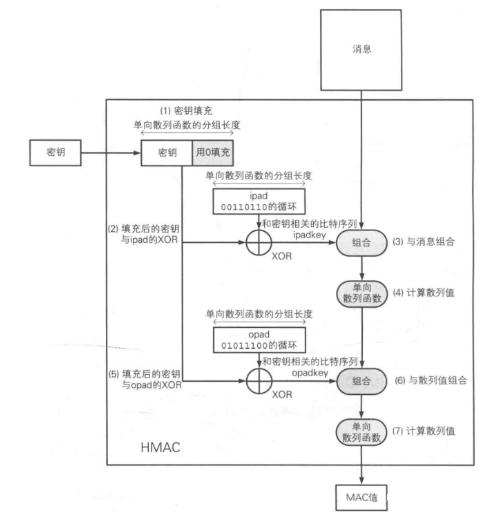

# 介绍

**HMAC（Hash-based Message Authentication Code**是一种基于哈希函数的消息认证码（`MAC`）算法，用于验证数据的完整性和真实性。它通过结合哈希算法与密钥来生成一个认证码，可以防止数据在传输过程中被篡改。`HMAC` 广泛应用于网络协议（如 `TLS`、`IPSec` 等）、数字签名以及 `API` 认证等场景中。

在这篇文章中，我们将深入了解 `HMAC` 的原理，并通过具体的计算过程来说明其如何工作。
<!--more-->
# HMAC的工作原理

`HMAC` 的工作原理可以通过以下几个步骤来描述：
1. 选择哈希算法：HMAC可以使用任何哈希函数，如 `MD5`、`SHA-1`、`SHA-256`等。算法的选择通常取决于安全要求及性能需求。

2. 密钥处理：`HMAC` 算法需要一个密钥。如果密钥的长度小于哈希函数的块大小，则需要对密钥进行填充，在末尾填充`0`。如果密钥的长度大于块大小，则首先对密钥进行哈希处理，使得密钥的长度与块大小一致。

3. 内外填充：在 `HMAC` 中，密钥会被分别与两个常量值（`ipad` 和 `opad`）进行组合：
    - `ipad`（内填充）：一个由 `0x36` 组成的块（长度等于哈希函数的块大小）。
    - `opad`（外填充）：一个由 `0x5C` 组成的块（长度等于哈希函数的块大小）。

4. 计算过程：HMAC的计算分为两个主要步骤：
    1. 内层哈希：首先将密钥与 `ipad` 进行异或运算，得到一个新的密钥。然后，将该新密钥与消息数据进行连接，并计算哈希值。
    2. 外层哈希：接着，将密钥与 `opad` 进行异或运算，得到一个新的密钥。然后，将该新密钥与第一步得到的哈希值进行连接，并计算哈希值。最终得到的哈希值就是 `HMAC` 值。




# HMAC的计算过程
下面通过具体的计算例子来详细说明 `HMAC` 的生成过程。假设我们使用 `SHA-256` 哈希算法，并且给定一个密钥和消息。

## 步骤1：准备工作
假设：

- 密钥：`K = "key"`
- 消息：`M = "The quick brown fox jumps over the lazy dog"`


首先，`SHA-256` 的块大小为 `64` 字节（`512` 位），因此我们需要将密钥扩展或截断为 `64` 字节的长度。如果密钥小于 `64` 字节，则通过补零使其长度达到 `64` 字节。

密钥扩展后：
```
K = "key" => 0x6B65790000000000000000000000000000000000000000000000000000000000
```

## 步骤2：内层计算
将密钥与 `ipad`（`0x36` 的重复块）进行异或，得到内层密钥：

```
K ⊕ ipad = 0x6B65790000000000000000000000000000000000000000000000000000000000
           ⊕ 0x3636363636363636363636363636363636363636363636363636363636363636
           ------------------------------------
           0x5D3187376C7D2D6C74702C7270657D6E7E7D696F7B7D7C0B68726D786D7E7F7E

```

接着，将内层密钥与消息M进行拼接，并对拼接后的数据进行 `SHA-256` 哈希计算：

```
H1 = SHA-256(K ⊕ ipad || M)
```

# 步骤3：外层计算
将密钥与 `opad`（`0x5C` 的重复块）进行异或，得到外层密钥：

```
K ⊕ opad = 0x6B65790000000000000000000000000000000000000000000000000000000000
           ⊕ 0x5C5C5C5C5C5C5C5C5C5C5C5C5C5C5C5C5C5C5C5C5C5C5C5C5C5C5C5C5C5C5C
           ------------------------------------
           0x1775744441E8B54D5F7D2A0C7640E45F2B70D1639B4D2B4C4D4D3A2B4F4F49F2
```
然后，将外层密钥与第一步计算得到的哈希值 `H1` 进行拼接，并对拼接后的数据进行 `SHA-256` 哈希计算：
```
HMAC = SHA-256(K ⊕ opad || H1)
```

最终，得到的 `HMAC` 就是我们需要的消息认证码。

# HMAC的安全性
`HMAC` 的安全性依赖于两个因素：

1. 哈希函数的安全性：如果选择的哈希函数本身存在安全漏洞（如碰撞攻击），则 `HMAC` 的安全性也会受到影响。

2. 密钥的管理：`HMAC` 依赖于密钥的机密性。如果密钥泄露，`HMAC` 的安全性将大大降低。

因此，建议使用强大的哈希算法（如 `SHA-256` 或更高版本的算法），并采取合适的措施管理密钥。

# HMAC的应用场景

`HMAC` 有许多应用场景，以下是一些常见的例子：

- `API`认证：通过 `HMAC` 可以确保请求的数据未被篡改，并且能够验证请求者的身份。

- 数字签名：`HMAC` 可用于签名消息，确保消息的完整性。

- 加密协议：如 `SSL/TLS`，`HMAC` 用于保证数据在传输过程中不被篡改。

# 总结
`HMAC` 是一种简单而强大的消息认证码算法，它结合了哈希函数和密钥的特性，能够有效地验证消息的完整性和真实性。通过理解 `HMAC` 的工作原理和计算过程，我们可以更好地应用它来增强我们的数据保护能力。
