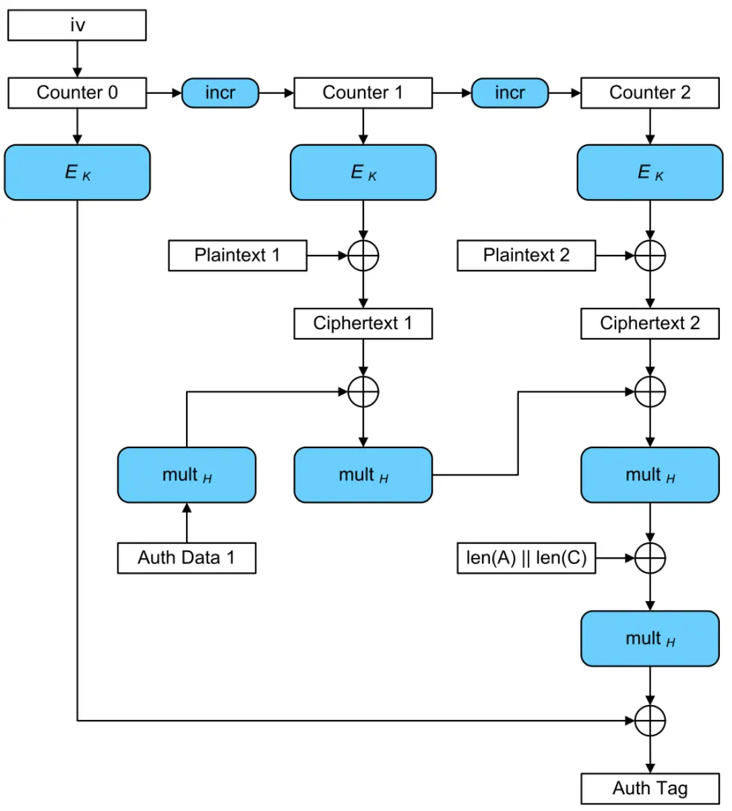

# 常见加密模式

## 为什么要分模式？
对称加密算法（如`AES`）只能加密**固定长度**的数据块（比如 `AES` 的块是 `128` 位）。如果要加密一个很长的文件，就需要将文件切分成多个块，再逐个加密。

**问题来了**：如何让这些块之间产生关联，避免被破解？这就是**加密模式**的作用！

<!--more-->

## 1. ECB模式（电子密码本）
- **原理**：
    - 把数据切成块，每块独立加密，像查字典一样（比如“A”对应“X”，“B”对应“Y”）。
    - 致命缺陷：相同的明文块会生成相同的密文块。

- **例子**：
    - 加密一张纯色图片（比如全黑），ECB加密后仍能看到轮廓（如下图）。
    - 加密“HelloHello”，两个“Hello”块加密后完全一样。

        


**结论：永远不要用ECB，除非加密单个块（比如一个密码）**。

## 2. CBC模式（密码块链）
- **原理**：
    1. 初始化向量（IV）：在加密第一个块前，生成一个随机数（IV），与第一个明文块做异或（XOR）。
    2. 链式反应：每个明文块加密前，先与前一个密文块做XOR，再加密。

- **例子**：
    - 加密“Hello”：
        - 生成IV（比如“随机数123”），与“Hello”做XOR，再加密。
        - 第二个块“World”先与第一个块的密文做XOR，再加密。

    - 即使两个明文块相同，加密后的结果也不同。

- **优点**：：安全性高，适合文件加密。
- **缺点**：
    - 需要存储或传输IV（通常明文传输，无需保密）。
    - 无法并行加密（必须按顺序处理块）。

## 3. CTR模式（计数器模式）
- **原理**：
    1. 生成一个计数器（比如从0开始递增：0,1,2,3…）。
    2. 加密计数器，得到一个密钥流（伪随机数）。
    3. 将密钥流与明文块做XOR，得到密文。

- **例子**：
    - 加密“Hello”：
        - 加密计数器0得到密钥流“X3k%”，与“Hello”XOR得到密文。
        - 加密计数器1得到密钥流“aB9$”，与下一个块XOR。

- **优点**：
    - 支持并行加密和解密（因为不依赖前一个块）。

    - 可以实时加密（比如视频流）。

- **缺点**：
    - 计数器不能重复（否则安全性崩溃）。

## 4. GCM模式（伽罗瓦计数器模式）
- **原理**：
结合CTR模式的高效性，并附加认证标签（MAC），验证数据是否被篡改。

- **例子**：
    - 加密一段消息后，生成一个“指纹”（比如“d8e9f”）。

    - 接收方解密时验证指纹，如果指纹不匹配，说明数据被篡改。

- **优点**：
    - 加密+认证一步完成（适合网络传输，如HTTPS）。
    - 高效且安全。

- **缺点**：
    - 实现复杂，需要处理计数器溢出问题。

## 5. CFB/OFB模式（反馈模式）
- 原理：
    - 类似于CTR，但生成密钥流的方式不同。
    - CFB（密码反馈）：将前一个密文块加密后生成密钥流。
    - OFB（输出反馈）：将前一个密钥流加密后生成新的密钥流。

- 用途：
    - 适合流数据（如实时语音），但现代应用更倾向用CTR或GCM。

##  加密模式对比表

| 模式 | 安全性 | 速度 | 并行性 | 适用场景 |
|------|--------|------|--------|----------|
| ECB  | ❌ 低   | ⚡快 | ✔️ 支持 | 已淘汰（仅用于单块加密） |
| CBC  | ✔️ 高   | 🐢 慢 | ❌ 不支持 | 文件加密（需顺序处理） |
| CTR  | ✔️ 高   | ⚡快 | ✔️ 支持 | 实时数据流（视频、网络传输） |
| GCM  | ✔️ 超高 | ⚡快 | ✔️ 支持 | 需要认证的传输（HTTPS、VPN） |
| CFB  | ✔️ 中   | 🐢 慢 | ❌ 不支持 | 遗留系统（逐渐被取代） |


> **ECB 是“独狼”，CBC是“链条”，CTR是“流水线”，GCM是“保镖+流水线”**

# 常见对称加密算法

| **算法**        | **加密模式**                               | **密钥长度**                        | **应用**                          | **优点**                                           | **缺点**                                    |
|-----------------|--------------------------------------------|-------------------------------------|-----------------------------------|--------------------------------------------------|---------------------------------------------|
| **AES (Advanced Encryption Standard)** | ECB, CBC, CTR, GCM, OFB, CFB                   | 128, 192, 256位                     | 数据加密、文件加密、通信加密等  | 安全性高，支持多种加密模式，广泛使用               | 对于某些模式（如ECB）存在模式相关的安全问题 |
| **DES (Data Encryption Standard)**     | ECB, CBC, OFB, CFB, CTR                     | 56位                                | 曾用于早期的加密系统               | 计算速度快，硬件支持广泛                       | 密钥长度过短，已不再安全                   |
| **3DES (Triple DES)**                  | ECB, CBC, OFB, CFB                         | 112位或168位                        | 用于替代DES的系统，金融领域等      | 提供比DES更强的安全性                           | 效率较低，逐渐被AES替代                    |
| **Blowfish**                            | ECB, CBC, OFB, CFB, CTR                    | 32位到448位                         | 用于文件加密、VPN、硬盘加密等     | 密钥长度灵活，速度较快，简单高效                  | 密钥管理不如AES，存在某些漏洞             |
| **RC4**                                 | 流加密模式（Stream Cipher）                 | 40位到2048位                        | WEP加密、SSL/TLS协议等             | 实现简单，速度较快                             | 存在已知安全漏洞，逐步被淘汰               |
| **Twofish**                             | ECB, CBC, OFB, CFB, CTR                    | 128位、192位、256位                 | 用于加密文件、通信协议、硬盘加密等 | 安全性高，灵活的密钥长度，设计简洁               | 相较于AES，使用较少，支持硬件加速较少       |


# 常见密钥协商算法

| **算法**                | **原理**                                                                 | **应用**                                   | **优点**                                                                                      | **缺点**                                                     |
|-------------------------|--------------------------------------------------------------------------|--------------------------------------------|----------------------------------------------------------------------------------------------|--------------------------------------------------------------|
| **Diffie-Hellman (DH)**  | 基于离散对数问题，允许双方在公开通道上协商出共享密钥。                     | 广泛用于TLS/SSL协议。                     | 安全性较高，理论上不易被破解。                                                                | 容易受到中间人攻击（MITM），缺乏身份认证。                  |
| **Elliptic Curve DH (ECDH)** | 使用椭圆曲线数学结构，提供与DH相同的安全性，但密钥尺寸更小。            | 现代加密协议，如TLS、VPN等。              | 高效、适合资源有限的设备。                                                                    | 需要更高的数学理解和实现复杂度。                             |
| **RSA**                  | 基于大整数分解问题，使用接收方的公钥加密会话密钥，接收方使用私钥解密。    | 传统的TLS/SSL协议，数字签名等。           | 安全性较高，已广泛应用。                                                                      | 加密效率较低，缺乏前向保密性，密钥较大。                      |
| **Quantum Key Distribution (QKD)** | 利用量子力学原理（量子纠缠、量子叠加）确保密钥交换的安全性。         | 未来的量子计算环境中的密钥交换。         | 极高的安全性，即使量子计算机出现也能保证安全。                                                | 目前技术不成熟，基础设施复杂且成本高。                       |
| **Post-Quantum Cryptography (PQC)** | 针对量子计算攻击的加密算法，确保在量子计算机时代仍然安全。            | 量子计算发展后的加密解决方案。            | 为未来量子计算带来的威胁提供抗性。                                                            | 当前实现不成熟，标准尚在制定中。                            |
| **Kerberos**             | 基于对称密钥的认证协议，使用中心认证服务器（KDC）进行身份验证和密钥分发。 | 企业环境中网络身份验证。                 | 提供安全的身份验证，支持单点登录（SSO）。                                                     | 需要配置复杂的KDC基础设施。                                  |
| **Secure Remote Password (SRP)** | 基于密码的认证协议，避免密码直接传输，双方使用共享密钥进行加密通信。  | 基于密码的应用，如安全远程登录。         | 提供无密码传输的安全验证，适合基于密码的应用。                                                | 实现复杂，性能上相对较差。                                  |


## AES-GCM

`AES-GCM（Advanced Encryption Standard - Galois/Counter Mode）`是一种结合加密和认证的对称加密模式，广泛应用于需要高效保密性和数据完整性的场景（如`TLS`、`IPSec`）。以下是其核心步骤的详细分解：

### 1. 参数初始化
- **密钥（Key）**：`128/192/256`位的 `AES` 密钥，用于加密和生成认证标签。
- **初始向量（IV）**：通常为 `12` 字节（**推荐长度**），需全局唯一，避免重复。
- **附加认证数据（AAD）**：可选明文数据，参与认证但不加密。
- **明文（Plaintext）**：待加密的数据。

## 2. 生成初始计数器块（J₀）
- `IV` 处理：
    - 若 `IV` 为 `12` 字节：直接作为前 `12` 字节，后接4字节计数器（`0x00000001`），组成 `16` 字节的 `J₀` 。
    - 若 `IV` 非 `12` 字节：通过 `GHASH` 计算生成J₀（见步骤`6`）。

## 3. 加密过程（CTR模式）
- 生成密钥流：
    - 初始计数器块：`J₀` 的`31`位最低有效位（`LSB`）递增，生成计数器序列 `J₀+1, J₀+2, ...`。
    - 对每个计数器块进行 `AES` 加密，生成密钥流块。

- 生成密文：
    - 明文分块（每块`16`字节）与对应密钥流异或，得到密文。

## 4. 认证过程（GHASH）
`GHASH` 核心操作：在 `Galois` 域（`GF(2¹²⁸)`）上的乘法，使用哈希子密钥 `H`,（**由加密全0块得到**, `H = AES-Encrypt(Key, 0¹²⁸)`）。

**步骤**：

1. **处理AAD**：
    - 将 `AAD` 填充为 `16` 字节的倍数，不够补零，分块为`A₁, A₂, ..., Aₘ`。
    - 计算 `GHASH`：初始为`X = 0`（`128位全0`），依次与 `AAD` 块异或后乘 `H`。

    `X = (X ⊕ A_i) ⊗ H（⊗ 表示伽罗瓦域乘法）`
2. **处理密文**：
    - 将密文填充为 `16` 字节的倍数，不够补零，分块为`C₁, C₂, ..., Cₙ`。
    - 继续 `GHASH` 计算，与密文块异或后乘 `H`。

    `X = (X ⊕ C_i) ⊗ H`

3. **处理长度块**：
    - 拼接 `AAD` 长度和密文长度（各`64`位），组成 `16` 字节块。
        - （1）单位必须为比特（bit）
        - （2）`64` 位无符号整数表示
        - （3）前 `8` 字节为 `AAD` 长度，后 `8` 字节为密文长度 的顺序拼接

    - 最后与长度块异或后乘 `H`，得到 `GHASH` 输出 `S` 。

    `Len = len(AAD) || len(Ciphertext)`

    `S = (X ⊕ Len) ⊗ H`

## 5. 生成认证标签（Tag）
- 加密`J₀`：`T = AES-Encrypt(J₀) ⊕ S`。
- 截断 `T` 为指定长度（通常`16`字节）作为最终认证标签。

## 6. 输出结果
- 密文（`Ciphertext`）：加密后的数据。
- 认证标签（`Tag`）：用于验证数据完整性和真实性的签名。

## 安全注意事项
- `IV` 唯一性：重复IV会导致密钥流复用，破坏安全性。
- 密钥管理：定期更换密钥，避免泄露。
- 认证失败处理：标签验证失败时需丢弃数据，防止篡改攻击。

```
+---------------------+
| 初始化参数           |
| - Key               |
| - IV                |
| - AAD               |
| - Plaintext         |
+---------------------+
          |
          v
+---------------------+
| 生成初始计数器块 J₀  | → 若IV=12字节: J₀ = IV || 0x00000001
|                     | → 否则: J₀ = GHASH(IV)
+---------------------+
          |
          v
+---------------------+       +---------------------+
| CTR模式加密          |       | GHASH认证过程       |
| 1. J₀+1, J₀+2,...    |       | 1. 计算H = AES(0)   |
| 2. 生成密钥流        |       | 2. 处理AAD → X      |
| 3. 明文异或密钥流 → 密文 |   | 3. 处理密文 → X     |
|                     |       | 4. 处理长度块 → S    |
+---------------------+       +---------------------+
          |                             |
          |                             v
          +------------+  +-------------+
                       |  |
                       v  v
+---------------------+
| 生成认证标签         |
| T = AES(J₀) ⊕ S      |
| 截断T为Tag           |
+---------------------+
          |
          v
+---------------------+
| 输出结果             |
| - 密文               |
| - Tag               |
+---------------------+
```

