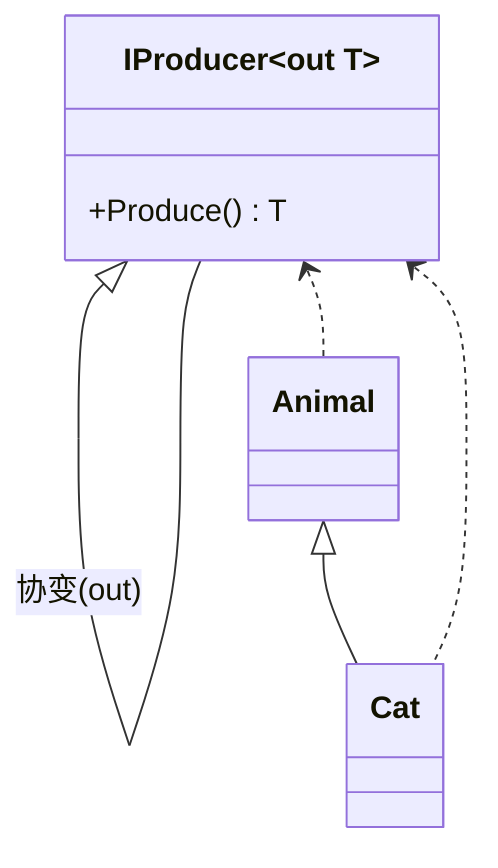
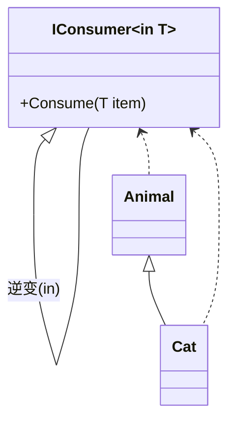

在 `C#` 泛型和委托的世界里，有两个经常让人皱眉的词：**协变（Covariance）** 和 **逆变（Contravariance）**。
它们的名字很抽象，但作用很实际：

> **它们允许你在泛型类型之间进行“安全”的类型替换，而不需要写一堆类型转换代码。**

# 1. 为什么会有协变和逆变
先看一个简单例子：

```csharp
class Animal { }
class Cat : Animal { }

IEnumerable<Animal> animals = new List<Cat>(); // 这样写可以
List<Animal> animalsList = new List<Cat>();    // ❌ 编译错误
```

为什么 `IEnumerable<Animal>` 可以指向 `List<Cat>`，而 `List<Animal>` 不行？
答案就是：**协变和逆变是编译器提供的“类型兼容规则”，而 `IEnumerable<T>` 支持协变，但 `iLst<T>` 不支持。**

<!--more-->

# 2. 基础概念
## 2.1 协变（Covariance）
- **方向：子类型 → 父类型**

- 允许将**泛型参数类型的派生类**，赋值给**泛型参数类型的基类**。

-  在 `C#` 里，用 `out` 修饰泛型类型参数来支持协变。

- 常见于 **只读** 场景（生产数据）。

```csharp
IEnumerable<Cat> cats = new List<Cat>();
IEnumerable<Animal> animals = cats; // ✅ 协变
```

**Mermaid** 图示:



## 2.2 逆变（Contravariance）
- **方向：父类型 → 子类型**

- 允许将**泛型参数类型的基类**，赋值给**泛型参数类型的派生类**。

- 在 `C#` 里，用 `in` 修饰泛型类型参数来支持逆变。

- 常见于 **只写** 场景（消费数据）。

```csharp
Action<Animal> actAnimal = a => Console.WriteLine(a);
Action<Cat> actCat = actAnimal; // ✅ 逆变
```

**Mermaid** 图示:




# 3. out 和 in 关键字
## 3.1 out（协变）

```csharp
public interface ICovariant<out T>
{
    T GetValue(); // ✅ 只能出（返回值）
    // void SetValue(T value); ❌ 编译错误
}
```
- **约束**：泛型参数 `T` 只能作为返回值（输出位置）。

- **原因**：如果能接收参数，就可能写入错误类型（破坏类型安全）。

## 3.2 in（逆变）
```csharp
public interface IContravariant<in T>
{
    void SetValue(T value); // ✅ 只能入（参数）
    // T GetValue(); ❌ 编译错误
}
```
- **约束**：泛型参数 `T` 只能作为方法参数（输入位置）。

- **原因**：如果能返回 `T`，调用方期望更具体类型时会出错。

# 4. 协变 & 逆变 代码实战

## 4.1 协变场景
```csharp
public interface IProducer<out T>
{
    T Produce();
}

public class CatProducer : IProducer<Cat>
{
    public Cat Produce() => new Cat();
}

class Program
{
    static void Main()
    {
        IProducer<Cat> catProducer = new CatProducer();
        IProducer<Animal> animalProducer = catProducer; // 协变
        Animal a = animalProducer.Produce();
    }
}
```
**要点**：`IProducer<T>` 中 `T` 只出不进，所以 `Cat → Animal` 合法。

## 4.2 逆变场景
```csharp
public interface IConsumer<in T>
{
    void Consume(T item);
}

public class AnimalConsumer : IConsumer<Animal>
{
    public void Consume(Animal item) => Console.WriteLine(item.GetType().Name);
}

class Program
{
    static void Main()
    {
        IConsumer<Animal> animalConsumer = new AnimalConsumer();
        IConsumer<Cat> catConsumer = animalConsumer; // 逆变
        catConsumer.Consume(new Cat());
    }
}
```

**要点**：`IConsumer<T>` 中 `T` 只进不出，所以 `Animal → Cat` 合法。

## 4.3 协变 + 逆变 同时使用（Func 委托）
```csharp
Func<Animal, Cat> func = a => new Cat();
Func<Cat, Animal> func2 = func; // 参数逆变，返回值协变
```
`Func<in T, out TResult>` 本身就是协变+逆变的复合例子。

# 5. 协变逆变的限制与注意点
1. **只能用于接口和委托**
类的泛型参数不能用 `in / out`。

2. **不能破坏类型安全**
协变接口不能在输入位置使用泛型参数，逆变接口不能在输出位置使用泛型参数。

3. **数组是天然协变的（但是有坑）**

```csharp
Animal[] animals = new Cat[10]; // 编译通过
animals[0] = new Dog();         // ❌ 运行时抛异常
```

**结论**：数组协变是运行时检查，泛型协变是编译时检查，后者更安全。
