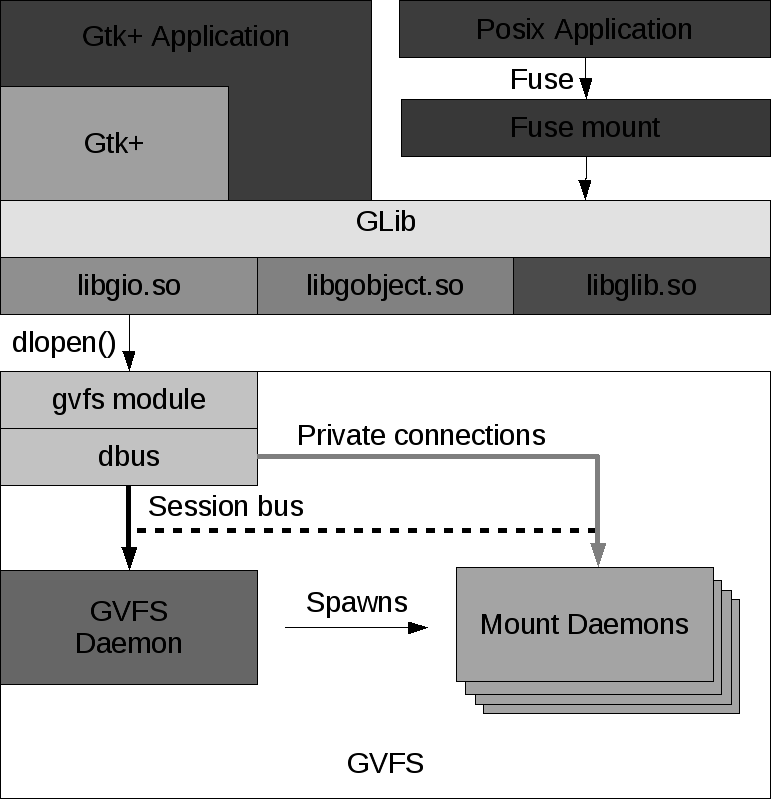

# 在UOS中文件管理器匿名访问共享修改文件导致文件变成只读根因分析报告

## 一、相关术语

|  缩写   |            全称             |                                                                                   描述                                                                                   |
| :-----: | :-------------------------: | :----------------------------------------------------------------------------------------------------------------------------------------------------------------------: |
| `Samba` |   `Samba`   |                                                           Samba是在Linux和UNIX系统上实现SMB协议的一个免费软件，由服务器及客户端程序构成。SMB（Server Messages Block，信息服务块）是一种在局域网上共享文件和打印机的一种通信协议，它为局域网内的不同计算机之间提供文件及打印机等资源的共享服务                                                            |
| `GVFS`  | `GNOME Virtual file system` | `GVFS` 是 `GNOME` 桌面系统的虚拟文件系统，通过 `GVFS` ，用户可以很容易的通过 `SFTP`、`FTP`、`WebDAV`、`SMB`等访问远程数据，通过 `HAL integration`、`OBEX` 等访问本地数据 |
|  `GIO`  |            `GIO`            |                                                        作为 `GLIB` 的一部分的新共享库，提供了针对 `GVFS` 的 `API`                                                        |

## 二、问题概述

【复现步骤】

1、`用户A` 在uos系统中准备一个包含文件的文件夹，并且`用户A` 对文件和文件夹具有可读可写权限。

2、`用户A` 通过文件管理器共享准备好的文件夹，并设置允许匿名访问。

3、`用户B` 通过文件管理器匿名访问这个共享文件夹并且修改共享目录中的文件。

4、修改的共享文件变为了只读，`用户 A` 无法再修改。
<!--more-->
【期望】

共享文件，`用户A` 和 `用户B` 都可以修改，可读写。

【环境】

硬件：该问题与硬件无关，在多个平台都能复现

系统：`uos 1021`

文管：跟文件管理器版本无关

`GVFS` : 1.38.1-5

`samba` : 2:4.9.5.4-1+deepin4

## 三、问题分析

【分析】

`用户A` 准备好共享文件夹，在终端查看文件权限：

```
总用量 8
drwxr-xr-x  2 yngty yngty 4096 11月 20 20:42 .
drwxr-xr-x 37 yngty yngty 4096 11月 20 20:41 ..
-rw-r--r--  1 yngty yngty    0 11月 20 20:42 1.txt
-rw-r--r--  1 yngty yngty    0 11月 20 20:42 2.txt

```

`用户A` 对 `1.txt` 和 `2.txt` 是具有可读可写权限。`用户B` 通过文件管理器访问共享并修改 `1.txt` 后， `用户A`再次在终端查看文件权限：

```
总用量 12
drwxrwxrwx  2 yngty  yngty   4096 11月 20 20:48 .
drwxr-xr-x 37 yngty  yngty   4096 11月 20 20:47 ..
-rwxr--r--  1 nobody nogroup    1 11月 20 20:48 1.txt
-rw-r--r--  1 yngty  yngty      0 11月 20 20:42 2.txt

```

`1.txt`的文件权限发生了更改，文件属主具有读、写和执行权限，属组和其他用户只具有读权限。并且文件属主更改为 `nobody`，文件属组更改为 `nogroup`。

现在 `1.txt` 是属于 `nobody` 了， 我们查看下 `nobody` 和 `用户A` 的信息，在 `/etc/passwd` 下: 

```
yngty@yngty-PC:~/test_samba$ cat /etc/passwd| grep -E "nobody|yngty"
nobody:x:65534:65534:nobody:/nonexistent:/usr/sbin/nologin
yngty:x:1000:1000::/home/yngty:/bin/bash
```

`yngty` 是 `用户A` 相对于 `nobody` 属于其他用户， 所以对 `1.txt` 只有可读权限。

在修改共享文件后，`用户A` 不能修改说明共享的文件，权限发生了改变。那么造成该现象有三种可能：

- 第一：文件管理器的共享功能有问题，导致用户访问通过文件管理器共享出来的文件后修改文件会导致权限不正确。
- 第二：文件管理器访问共享有问题，导致用户访问后修改后权限不正确。
- 第三：`smb`协议实现的问题，`smb`读写会修改文件权限。

首先对第一种情况进行测试，`用户A` 不通过文件管理器共享文件夹， 直接修改`smb`配置，配置个`test` 共享文件夹并支持匿名访问：

在 `/etc/samba/smb.cnf` 文件最后面增加：

```
[test]
   comment = test smb
   path = /home/yngty/test_smb
   browseable = yes
   usershare allow guests = yes
   guest ok = yes
   read only = no

```

`用户B` 通过文件管理器访问 `test`共享文件夹，修改文件后，文件的权限还是改变了和复现步骤结果一模一样，排除了文件管理器共享功能出的问题。继续往下排查。

`uos` 中的文件管理器使用 `samba` 功能， 是采用 `GVFS` 提供的服务。

- 什么是`GVFS`
  
  >`GVFS`是GNOME桌面系统的虚拟文件系统，通过`GVFS`，用户可以很容易的通过`SFTP`、`FTP`、`WebDAV`、`SMB`等访问远程数据，通过`HAL integration`、`OBEX`等访问本地数据。(`GVFS` 是 `GNOME-VFS` 的替代品， 可以理解为`GNOME-VFS`已被废弃)

  >`GVFS` 包含两个部分：
  `GIO`，作为 `GLib`的一部分的新共享库，提供了针对 `GVFS` 的 `API`；
  `GVFS` 本身是一个包含多种文件系统和协议（如`SFTP`， `FTP`， `DAV`， `SMB` 和 `ObexFTP`）支持的后台软件包。
  `GVFS`致力于提供一个现代的，易用的 VFS 系统。它的目标是提供一些列 API 给开发者，以是他们不再使用原始的 POSIX IO 访问。它提供了一个更高级的以文件为中心的接口，而不仅仅是 POSIX IO 的复制品。除了文件的读写支持外，GIO 还提供了文件监视工具，异步 IO，和文件名完成功能。

  >`GVFS` 通过运行一个单独的主守护进程 (`GVFSD`) 来工作，它保证了对当前的 `GVFS` 挂载的跟踪。每一个挂载都有独立的守护进程。(一些挂载也会同时共享一个进程，但多数情况下不会这样。) 客户端通过一个联合 `D-Bus` 会话来与这些挂载通信(在会话总线上，但是使用点对点 `D-Bus`)，同时用一个用户协议来进操作文件内容。通过进程进行后台传递大大简化了程序的依赖关系，使整个系统更加健壮。

  >`GVFS` 也提供了在 `/run/user/1000/GVFS`提供了一个 `FUSE` 挂载点，这样可以使得 `GVFS` 挂载可以被传统的使用标准 `POSIX IO`的应用程序使用。 


<!-- <br>
<center>
    
    <center>GVFS架构设计图</center>
</center> 

<br> -->

`GVFS` 框架比较庞大，可以在`/usr/lib/gvfs/`目录下看到很多`gvfs`开头的应用程序。我们只需要关注跟 `samba` 相关的部分。

- `gvfsd-*` 为每个对应协议`protocol`的后端`daemon`程序。 
-  通过 `gvfsd-smb` 实现了对 `samba` 共享的访问、读写、挂载等。
-  通过 `gvfsd-smb-browse` 实现了在网络上查找并安装 `samba` 共享文件夹。
-  `gvfsd-smb` 和 `gvfsd-smb-browse` 底层都是依赖 `libsmbclient` 实现 `smaba` 相关的操作。
-  通过 `gvfsd-fuse` 为`fuse`提供支持，保证传统使用标准 `POSIX IO` 的程序无须改动代码即可访问远。


`GVFS` 支持 `samba` 功能调用的是`gvfs-smb`，底层调用的`libsmbclient`， 我们可以写一个 `demo` 来验证直接匿名调用`libsmbclient`读写接口文件权限是否会改变：

``` c
int main(int argc， char *argv[])
{
    SMBCCTX *context;
    char buf[1024];
    int fd;
    int ret;
    int debug = 1;
    char buffer[2048];
    smbc_stat_fn smbc_stat;
    /* Allocate a new context */
    context = smbc_new_context();
    if (!context)
    {
        printf("Could not allocate new smbc context\n");
        return 1;
    }

    /* Tell the compatibility layer to use this context */
    smbc_setWorkgroup(context， "WORKGROUP");
    smbc_setFunctionAuthDataWithContext(context， auth_callback);
    smbc_setOptionUseKerberos(context， 1);
    smbc_setOptionFallbackAfterKerberos (context， 1);
    smbc_setOptionNoAutoAnonymousLogin(context， 0); // 匿名访问
    smbc_set_context(context);

    /* Initialize the context using the previously specified options */
    if (!smbc_init_context(context))
    {
        smbc_free_context(context， 0);
        printf("Could not initialize smbc context\n");
        return 1;
    }
    
    if ((fd = smbc_open("smb://localhost/test_samba/1.txt"， O_WRONLY， 0)) < 0)
    {
        perror("smbc_open");
    }

    snprintf(buffer， sizeof(buffer)， "%s"， "Hello world\n");

    ret = smbc_write(fd， buffer， strlen(buffer));
    smbc_close(fd);
}

static void
auth_callback(SMBCCTX *context，
              const char *server_name， const char *share_name，
              char *domain_out， int domainmaxlen，
              char *username_out， int unmaxlen，
              char *password_out， int pwmaxlen)
{
    printf("auth_callback\n");
    // 用户和密码传空
    strncpy(username_out， ""， 0);
    strncpy(password_out， ""， 0);
    return;
}
```

读写前后 `1.txt` 文件权限并没有没有发生更改：

```
调用前:
yngty@smile:~/test_samba$ ls -al
总用量 8
drwxrwxrwx  2 yngty yngty 4096 11月 23 13:40 .
drwxr-xr-x 39 yngty yngty 4096 11月 23 11:44 ..
-rwxrw-rw-  1 yngty yngty    0 11月 23 13:40 1.txt
调用后:
yngty@smile:~/test_samba$ ls -al
总用量 12
drwxrwxrwx  2 yngty yngty 4096 11月 23 13:40 .
drwxr-xr-x 39 yngty yngty 4096 11月 23 11:44 ..
-rwxrw-rw-  1 yngty yngty   12 11月 23 13:41 1.txt

```
排除了第三种，`smb`协议实现的问题。`libsmbclient` 的读写不会修改文件权限。

- 缩小问题范围

我们监听原用户`用户A`共享目录，查看文件权限发生了什么变化。 `gio monitor` 提供了此功能：


```
yngty@yngty-PC:~/test_samba$ gio monitor ./
./: /home/yngty/test_samba/~gvfwUIj.tmp: created
./: /home/yngty/test_samba/~gvfwUIj.tmp: changes done
./: /home/yngty/test_samba/~gvfwUIj.tmp: attributes changed
./: /home/yngty/test_samba/~gvfwUIj.tmp: changed
./: /home/yngty/test_samba/~gvfwUIj.tmp: changes done
./: /home/yngty/test_samba/~gvfwUIj.tmp: attributes changed
./: /home/yngty/test_samba/1.txt: deleted
./: /home/yngty/test_samba/~gvfwUIj.tmp: renamed to /home/yngty/test_samba/1.txt

./: /home/yngty/test_samba/1.txt: attributes changed
```

我们发现文件保存时是先临时创建了`tmp`文件，然后进行文件操作后将原文件删除，最后将临时文件修改为原文件名。
查看 `GVFS` 源码，在`gvfsbackendsmb.c`，发现 `do_replace`函数， 这个函数功能是

* 1）保存到tmp文件
* 2）将orig文件重命名为备份文件，如果没有备份，则将其删除
* 3）将tmp文件重命名为orig文件

我们在函数加入打印日志，证明调用了此函数：

```c
static void
do_replace (GVfsBackend *backend，
	    GVfsJobOpenForWrite *job，
	    const char *filename，
	    const char *etag，
	    gboolean make_backup，
	    GFileCreateFlags flags)
{
    g_debug("come here: do_replace...filename = %s\n");
    ....
}
```

重新运行gvfs， `用户B` 按照实验步骤操作，查看输出日志，的确输出了我们的打印日志。

```
open_for_write_new_handle_common.............
smb: backend_dbus_handler org.gtk.vfs.Mount:OpenForWriteFlags (pid=29846)
smb: Queued new job 0x7f6ebc014270 (GVfsJobOpenForWrite)
smb: send_reply(0x558cb0)， failed=0 ()
come here: do_replace...filename = /3.txt
....
```
【思考】

那么现在问题的轮廓应该是：权限改变的原因是 `GVFS` 先创建临时文件。那么 `GVFS` 在 `samba`创建的文件的权限依据是什么？

查阅`samba`文档可知:

- `guest account`
  
    指定匿名访问的用户名，默认值为 `nobody`

- `create mask` 

    创建文件的掩码，默认值是 `0744`。 在`samba`中创建的文件将从该参数创建的`UNIX`模式与默认情况下设置为`000`的`force create mode`参数值进行位“或”运算 。

- `force create mode`

    默认值是 `0000`，见上面的描述。相当于此参数中所设置的权限位一定会出现在文件的属性中。

- `directory mode`
  
    创建目录的掩码，默认值是 `0755`，在`samba`中创建的文件还需要与默认情况下设置为 `000` 的 `force directory mode` 参数值进行位“或”运算 。

- `force directory mode`
    默认值是 `0000`，见上面的描述。相当于此参数中所设置的权限位一定会出现在目录的属性中。


查看 `libsmbclient` 源码中也发现了默认`guest account` 是：

```
#ifndef GUEST_ACCOUNT
#define GUEST_ACCOUNT "nobody"
#endif
```

这与我们实验步骤创建的文件的属主名一致。

创建的文件和目录的权限是根据 `samba`服务器中的`smb.conf`配置创建文件和创建目录的权限，
`create mask` 、`force create mode` 、 `directory mode` 、 `force directory mode`。默认情况下文件属组权限和其他用户权限没有写和执行权限。对`nobody` 来讲原用户属于其他用户所以只有读没有了写权限。接下来用实验进行验证。

## 四、实验验证


【实验环境】

系统：`uos 1021`

文管：跟文件管理器版本无关

`GVFS` : 1.38.1-5

【实验设计】


**实验一、修改 samba配置 `guest` 用户**


修改共享目录服务器 `smb.conf` 配置， 修改 `guest account`为共享文件夹用户的用户名。

在 /etc/samba/smb.cnf 文件中 `global` 项下面添加：

```
security = user
guest account = yngty #yngty 是用户A的当前用户名
```

然后重启 `SMB` 服务 `sudo systemctl restart smbd.service`

【实验验证】

`用户B` 按照实验步骤去访问共享并修改文件，原用户终端下查看共享目录:

```
总用量 8
drwxr-xr-x  2 yngty yngty 4096 11月 20 20:42 .
drwxr-xr-x 37 yngty yngty 4096 11月 20 20:41 ..
-rwxr--r--  1 yngty yngty    0 11月 20 20:42 1.txt

```
虽然还是匿名访问修改文件，但 `1.txt` 的属主和属组是`yngty`不再是默认`nobody` 和 `nogroup`，确定修改配置是生效的。所以原用户还是具有可写权限，原用户去读写修改文件也是可以正确操作。

**实验二、修改`samba`配置中文件和目录的创建权限**

`用户A` 修改共享目录服务器 `smb.conf` 配置，增加文件和目录的组权限和其他权限都支持可读可写。

在 `/etc/samba/smb.cnf` 文件中 `global` 项下面添加

```
create mask = 0766
force create mode = 0766
directory mode = 0766
force directory mode = 0766

```

然后重启 `SMB` 服务`sudo systemctl restart smbd.service`

【实验验证】

`用户B` 按照实验步骤去访问共享并修改文件，原用户终端下查看共享目录:

```
总用量 8
drwxrwxrwx  2 yngty  yngty   4096 11月 20 20:48 .
drwxr-xr-x 37 yngty  yngty   4096 11月 20 20:47 ..
-rwxrw-rw-  1 nobody nogroup    1 11月 20 20:48 1.txt
```
发现文件 `1.txt` 的属主和属组还是`nobody`和 `nogroup`，但文件的组权限其他用户权限具有了可写权限，确定修改配置是生效的。对于原用户 `用户A` 也是可写。


## 五、解决方案

根据上述实验可知，我们可以修改匿名访问用户名，为共享文件夹用户的用户名和 `smaba` 中创建文件和目录的权限来解决问题。

**方案一：修改`samba` 配置 `guest` 用户**

文件管理器在匿名访问的时候没有指定用户，默认使用`nobody`， 我们可以将`guest` 用户修改为当前用户，这样匿名访问的就是使用的当前用户，就不存在当前用户没有权限的问题。

此方法为有效的解决方式，但可行性低。在`uos`系统中可以多用户运行，不同用户要使用此功能都需要修改对应的`samba`配置为当前的用户，而且用户之间还会互相影响。


**方案二：修改`samba`配置中文件和目录的创建权限**

修改`samba`配置的默认文件和目录的创建权限如下:

```
create mask = 0766
force create mode = 0766
directory mode = 0766
force directory mode = 0766
```

虽然文件是`nobody`创建的但文件的属组和其他用户都有可读可写权限， 原用户和匿名访问用户都能够读写。不足的地方就是所有用户都具有读写权限，不是绝对的安全。享受了便利性就失去了绝对的安全。

**方案三：修改 `GVFS` 的源码，修改共享文件后，不改变文件权限**

这个问题可以算是 `GVFS` 的 `bug`，可以修改 `GVFS` 的源码，修改共享文件后，不改变文件权限。


**方案比较**

|                 方案                  |       性能       |             稳定             |     安全     |                         易用                         |           兼容           |
| :-----------------------------------: | :--------------: | :--------------------------: | :----------: | :--------------------------------------------------: | :----------------------: |
|     修改`samba` 配置 `guest` 用户     | 对性能都影响极小 | 不稳定，多用户之间会互相影响 | 安全性不高，可以伪装为当前共享用户 | 开发复杂，需要对每个用户定制修改，需要其他项目组协助 | 不需要改动文件管理器代码 |
| 修改`samba`配置中文件和目录的创建权限 | 对性能都影响极小 |             稳定             | 不是绝对安全，所有用户都具有可写权限 |         修改简单，多用户支持，不需要重新修改         | 不需要改动文件管理器代码 |
| 修改 `GVFS` 的源码，修改共享文件后，不改变文件权限 | 对性能都影响极小 |             稳定             | 安全 |         修改较复杂，多用户支持，不需要重新修改         | 不需要改动文件管理器代码 |

方案一改动复杂，不同用户还会互相影响，方案二能够解决该问题，且改动对其它代码影响较小，方案三最有可能从根本上解决掉该问题，但需要花费较多时间、改动较复杂，可以作为改进的方向。

## 六、小结

【方案敲定】

根据上述对方案分析，方案一从可行性方面被否决，考虑到时间成本，方案二可以作为现阶段的最优解，将方案三作为改进的方向，所以现阶段最终采用方案二。

【问题总结】

问题根因：`GVFS` 中的`SMB`访问是将`SMB`挂载到本地一个文件系统，文件的修改是先创建一个临时文件，修改数据，删掉原文件，最后将文件重命名为原文件名。创建临时文件的用户是当前访问共享的用户，匿名访问就是`nobody`，创建文件的权限根据 `samba`服务器中的`smb.conf`配置文件设置的权限，默认情况文件属组和其他组没有可写可执行权限。文件属主的改变导致原用户没有了可写权限。

解决方案：修改`samba`配置中文件和目录的创建权限为:

```
create mask = 0766
force create mode = 0766
directory mode = 0766
force directory mode = 0766
```
根因查找步骤：现象->分析->思考->实验->验证->结论。

关键步骤：监听目录文件改变，查看 `GVFS` 源码， 找到权限改变的根因。

改进/优化：修改 `GVFS` 的源码，修改共享文件后，不改变文件权限。


## 七、参考资料

* [GVFS源码](https://gitlab.gnome.org/GNOME/GVFS)
* [Backends for GVFS 1.30.0](https://wiki.gnome.org/Projects/GVFS/backends)
* [samba源码](https://git.samba.org/samba.git)
* [linux的文件权限与目录配置](http://cn.linux.vbird.org/linux_basic/0210filepermission.php)
* [维基百科samba介绍](https://zh.wikipedia.org/wiki/Samba) 

  

