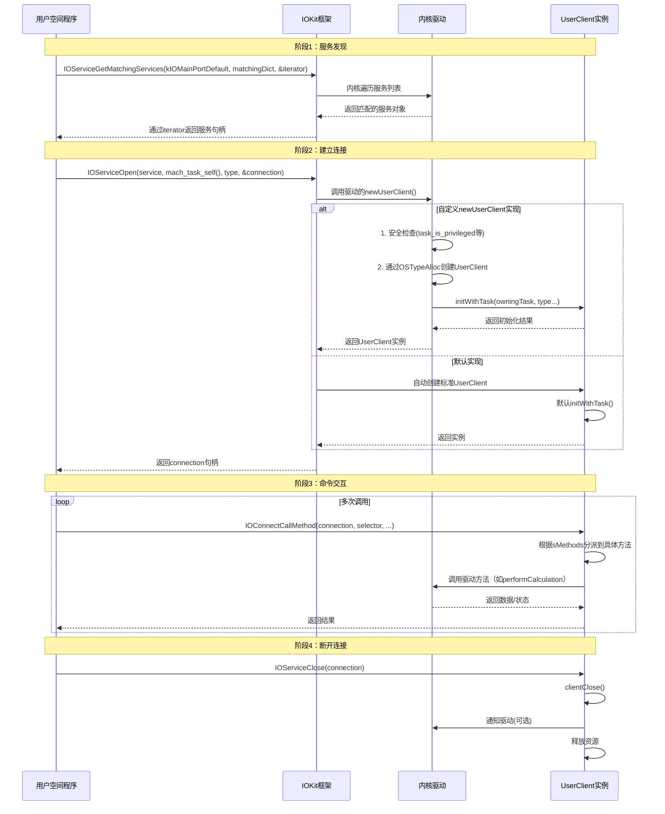

### 完整调用流程



## IODataQueueMemory

### 用户层代码

```
void ControllerImpl::MsgRecvThreadFunc() {
    kern_return_t kr;
    UInt32 dataSize;
    IODataQueueMemory* queueMappedMemory;
    vm_size_t queueMappedMemorySize;
    mach_vm_address_t address = 0;
    mach_vm_size_t size = 0;
    mach_port_t recvPort;
    TestMessage msg;

    // allocate a Mach port to receive notifications from the IODataQueue
    if ((recvPort = IODataQueueAllocateNotificationPort()) == MACH_PORT_NULL) {
        return;
    }

    // this will call registerNotificationPort() inside our user client class
    kr = IOConnectSetNotificationPort(m_nConnection, QUEUETYPE_MONITOR, recvPort, 0);
    if (kr != kIOReturnSuccess) {
        mach_port_destroy(mach_task_self(), recvPort);
        return;
    }

    // this will call clientMemoryForType() inside our user client class
    kr = IOConnectMapMemory(m_nConnection, kIODefaultMemoryType, mach_task_self(), &address, &size, kIOMapAnywhere);
    if (kr != kIOReturnSuccess) {
        mach_port_destroy(mach_task_self(), recvPort);
        return;
    }

    queueMappedMemory = (IODataQueueMemory*)address;
    queueMappedMemorySize = size;

    while (!m_bStop && IODataQueueWaitForAvailableData(queueMappedMemory, recvPort) == kIOReturnSuccess) {
        while (!m_bStop && IODataQueueDataAvailable(queueMappedMemory)) {
            dataSize = sizeof(msg);
            kr = IODataQueueDequeue(queueMappedMemory, &msg, &dataSize);
            if (kr != kIOReturnSuccess) {
                continue;
            }

           Callback(msg);

        }  // end while (IODataQueueDataAvailable(queueMappedMemory))
    }      // end while (IODataQueueWaitForAvailableData

exit:

    kr = IOConnectUnmapMemory(m_nConnection, kIODefaultMemoryType, mach_task_self(), address);
    if (kr != kIOReturnSuccess) {
    }

    mach_port_destroy(mach_task_self(), recvPort);

}
```
