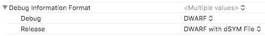

# `.dSYM`

`.dSYM` (`debugging SYMbols`) 又称为调试符号表，是苹果为了方便调试和定位问题而使用的一种调试方案，本质上使用的是起源于贝尔实验室的 `DWARF`（`Debugging With Attributed Record Formats`），其在.xcarchive目录中的层次结构为：

```
.xcarchive
--dSYMs
  |--Your.app.dSYM
    |--Contents
      |--Resources
        |--DWARF
```
<!--more-->
如果在XCode中设置了带有 `dSYM` 文件的 `DWARF` 选项，则编译器会生成 `dSYM` 文件，并将其存储在您的构建中。



# 确定符号表和崩溃日志的一致性

## 崩溃日志中获取UUID
崩溃日志比较靠下的位置有个 `Binary Images` 模块，其第一行内容如下：

```
Binary Images:
0x109724000 - 0x109cf7fff Your <19a667b1-8910-3890-a0b0-03befee8876e> /Library/Application Support/YourApp/*/YourApp.app/Contents/MacOS/YourApp

```
- 代码段的起终地址: `0x109724000 - 0x109cf7fff`
- 应用的UUID：`19a667b1-8910-3890-a0b0-03befee8876e`（不区分大小写）

## 从符号表中获取UUID

```shell
➜ dwarfdump --uuid Your.app.dSYM
```
或者：
```shell
➜ dwarfdump --uuid Your.app.dSYM/Contents/Resources/DWARF/Your
```

**崩溃日志中和符号表中的UUID一致，才能正确解析**

# 计算崩溃符号表地址

## 符号表堆栈地址计算方式
```
Thread 0::  Dispatch queue: com.apple.main-thread
0   libsystem_kernel.dylib        	    0x7ff8159e775e write + 10
1   libapr-1.0.dylib              	    0x10a6c1cee apr_file_write + 286
2   liblog4cxx.10.0.0.dylib       	    0x10a369531 log4cxx::helpers::FileOutputStream::write(log4cxx::helpers::ByteBuffer&, log4cxx::helpers::Pool&) + 81
3   Your      	                        0x10a3ae877❶  0x10a340000❷ + 452727❸
```

- ❶ 运行时堆栈地址
- ❷ 运行时起始地址
- ❸ 偏移量

```
运行时堆栈地址 = 运行时起始地址 + 偏移量
```

崩溃堆栈中的起始地址和崩溃地址均为运行时地址，根据虚拟内存偏移量不变原理，只要提供了符号表TEXT段的起始地址，再加上偏移量就能得到符号表中的堆栈地址，即：

```
符号表堆栈地址 = 符号表起始地址 + 偏移量
```

## 符号表中TEXT段的起始地址可以通过以下命令获得：

使用 `otool` 查找 `LC_SEGMENT_64` 段和 `vmaddr` 条目

```shell
➜ otool -l Your.app.dSYM/Contents/Resources/DWARF/Your
```

```
Load command 4
      cmd LC_SEGMENT_64
  cmdsize 232
  segname __TEXT
   vmaddr 0x0000000100000000·
   vmsize 0x0000000000004000
  fileoff 0
 filesize 0
  maxprot 0x00000005
 initprot 0x00000005
   nsects 2
    flags 0x0
```
其中的`vmaddr 0x0000000100000000`字段即为TEXT段的起始地址。

# 使用 `LLDB` 进行符号化

## crashlog

```shell
➜ xcrun lldb

(lldb) command script import lldb.macosx.crashlog

(lldb) crashlog <path/to/crashlog.crash>
```
## Target
```shell
(lldb) target create --no-dependents --arch <architecture> <path/to/dSYMs/App.app.dSYM/Contents/Resources/DWARF/App>

(lldb) image lookup --address <symboladdress>
```

# 使用 `ATOS` 符号化

## 符号表崩溃地址的解析方式
```shell
➜ atos -arch <architecture> -o <binary filename> -l <load address> <stack address 1> <stack address 2> ...
```

## 无需符号表崩溃地址的解析方式
```shell
➜ atos -arch <architecture> -o <binary filename> <symboladdress>
```

# 使用 `Dwarfdump` 符号化

```shell
➜ dwarfdump --arch x86_64 Your.app.dSYM --lookup symboladdress
```
