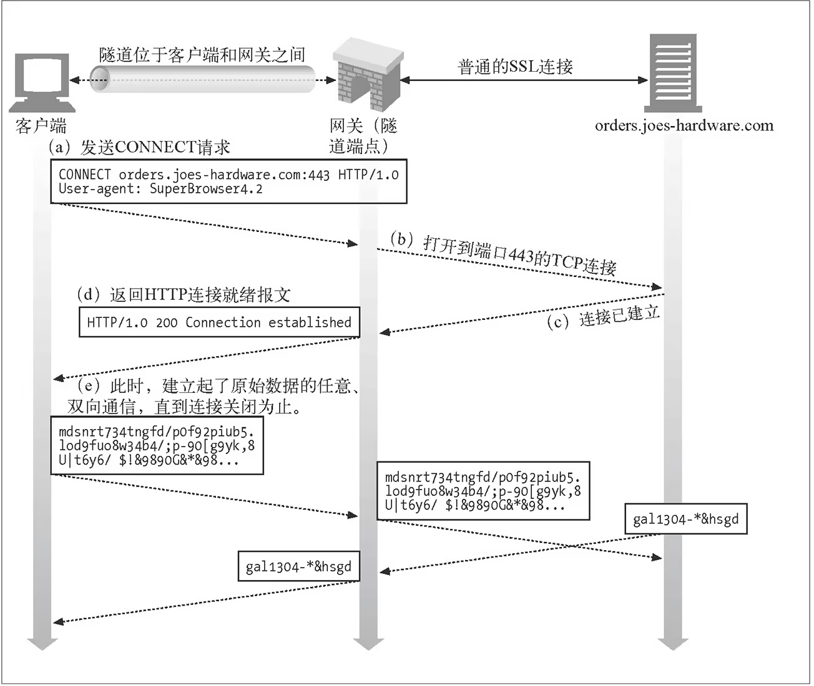

# 1. 引言
在网络通信中，`HTTP` 代理是一个常见的工具，用于在客户端和服务器之间中转HTTP请求和响应。它可以用于多种目的，包括提升安全性、管理网络流量、提高访问速度等。

# 2. HTTP代理的基本概念
代理服务器的定义：代理服务器（`Proxy Server`）是一种位于客户端和目标服务器之间的中间服务器，用于转发客户端的请求并将服务器的响应返回给客户端。

`HTTP` 协议基础：`HTTP`（`Hypertext Transfer Protocol`）是用于分布式、协作式和超媒体信息系统的应用层协议，是万维网数据通信的基础。

# 3. HTTP代理的工作原理
请求流程：

客户端发送 `HTTP` 请求到代理服务器。
代理服务器接收请求并将其转发给目标服务器。
目标服务器处理请求并返回响应给代理服务器。
代理服务器将响应返回给客户端

响应流程：

与请求流程类似，代理服务器在请求和响应过程中充当中间人角色。

数据传输和处理：

代理服务器可以对传输的数据进行缓存、过滤和修改。

```
+--------+     HTTP Request     +-----------+    HTTP Request     +-----------+
| Client |--------------------->| Proxy     |-------------------->| Target    |
|        |                      | Server    |                     | Server    |
+--------+                      +-----------+                     +-----------+
          <---------------------                  <----------------
           HTTP Response                          HTTP Response

```

# 4. HTTP代理的类型

## 普通代理

`HTTP` 客户端向代理发送请求报文，代理服务器需要正确地处理请求和连接（例如正确处理 `Connection: keep-alive`），同时向服务器发送请求，并将收到的响应转发给客户端。 这种代理扮演的是「`中间人`」角色，对于连接到它的客户端来说，它是服务端；对于要连接的服务端来说，它是客户端。它就负责在两端之间来回传送 `HTTP` 报文。

```shell
➜  ~ curl -vvv http://baidu.com
*   Trying 39.156.66.10:80...
* Connected to baidu.com (39.156.66.10) port 80
> GET / HTTP/1.1
> Host: baidu.com
> User-Agent: curl/8.4.0
> Accept: */*
```

```shell
➜  ~ curl -vvv -x http://127.0.0.1:8080 http://www.baidu.com
*   Trying 127.0.0.1:8080...
* Connected to 127.0.0.1 (127.0.0.1) port 8080
> GET http://www.baidu.com/ HTTP/1.1
> Host: www.baidu.com
> User-Agent: curl/8.4.0
> Accept: */*
> Proxy-Connection: Keep-Alive
```
### 完整路径

### Proxy-Connection

`Connection`，以及 `Connection` 定义的其它 `Header`，只是对上个节点和当前节点之间的连接进行说明，必须在报文转给下个节点之前删除，否则可能会引发后面要提到的问题。其它不能传递的 `Header` 还有`Prxoy-Authenticate`、`Proxy-Connection`、`Transfer-Encoding` 和 `Upgrade`。

`「close」`表示操作完成后需要关闭当前连接；`Connection` 还允许任何字符串作为它的值，如`「my-connection」`，用来存放自定义的连接说明。`HTTP/1.0` 默认不支持持久连接，很多 `HTTP/1.0` 的浏览器和服务器使用「`Keep-Alive`」这个自定义说明来协商持久连接：浏览器在请求头里加上 `Connection: Keep-Alive`，服务端返回同样的内容，这个连接就会被保持供后续使用。对于 `HTTP/1.1`，`Connection: Keep-Alive` 已经失去意义了，因为 `HTTP/1.1` 除了显式地将 `Connection` 指定为 `close`，默认都是持久连接。

有了上面的背景知识，我们来看问题。互联网上，存在着大量简陋并过时的代理服务器在继续工作，它们很可能无法理解 `Connection`——无论是请求报文还是响应报文中的 `Connection`。而代理服务器在遇到不认识的 `Header` 时，往往都会选择继续转发。大部分情况下这样做是对的，很多使用 `HTTP` 协议的应用软件扩展了 `HTTP` 头部，如果代理不传输扩展字段，这些软件将无法工作。

如果浏览器对这样的代理发送了 `Connection: Keep-Alive`，那么结果会变得很复杂。这个 `Header` 会被不理解它的代理原封不动的转给服务端，如果服务器也不能理解就还好，能理解就彻底杯具了。服务器并不知道 `Keep-Alive` 是由代理错误地转发而来，它会认为代理希望建立持久连接，服务端同意之后也返回一个 `Keep-Alive`。同样，响应中的 `Keep-Alive` 也会被代理原样返给浏览器，同时代理还会傻等服务器关闭连接——实际上，服务端已经按照 `Keep-Alive` 指示保持了连接，即使数据回传完成，也不会关闭连接。另一方面，浏览器收到 `Keep-Alive` 之后，会复用之前的连接发送剩下的请求，但代理不认为这个连接上还会有其他请求，请求被忽略。这样，浏览器会一直处于挂起状态，直到连接超时。

这个问题最根本的原因是代理服务器转发了禁止转发的 Header。但是要升级所有老旧的代理也不是件简单的事，所以浏览器厂商和代理实现者协商了一个变通的方案：首先，显式给浏览器设置代理后，浏览器会把请求头中的 `Connection` 替换为 `Proxy-Connetion`。这样，对于老旧的代理，它不认识这个 `Header`，会继续发给服务器，服务器也不认识，代理和服务器之间不会建立持久连接（不能正确处理 `Connection` 的都是 `HTTP/1.0` 代理），服务器不返回 `Keep-Alive`，代理和浏览器之间也不会建立持久连接。而对于新代理，它可以理解 Proxy-Connetion，会用 `Connection` 取代无意义的 `Proxy-Connection`，并将其发送给服务器，以收到预期的效果。

显然，如果浏览器并不知道连接中有老旧代理的存在，或者在老旧代理任意一侧有新代理的情况下，这种方案仍然无济于事。所以有时候服务器也会选择彻底忽略 `HTTP/1.0` 的 `Keep-Alive` 特性：对于 `HTTP/1.0` 请求，从不使用持久连接，也从不返回 `Keep-Alive`。

## 隧道代理

`HTTP` 客户端通过 `CONNECT` 方法请求隧道代理创建一条到达任意目的服务器和端口的 `TCP` 连接，并对客户端和服务器之间的后继数据进行盲转发。详见 [RFC 7231 - HTTP/1.1: Semantics and Content](https://datatracker.ietf.org/doc/html/rfc7231#section-4.3.6)


