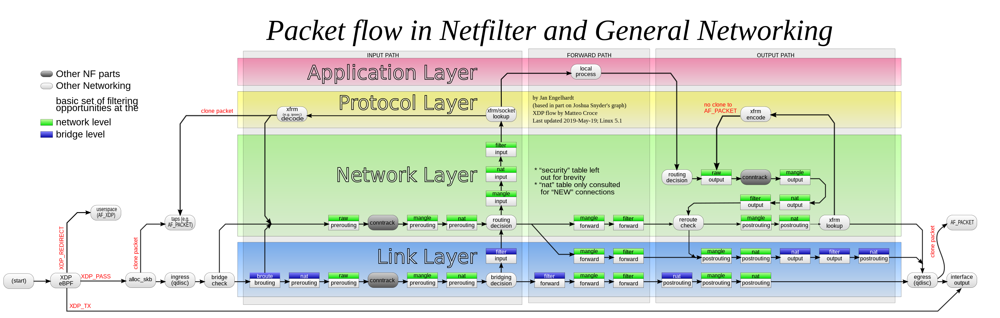

`Netfilter`，在 `Linux` 内核中的一个软件框架，用于管理网络数据包。不仅具有网络地址转换（`NAT`）的功能，也具备数据包内容修改、以及数据包过滤等防火墙功能。利用运作于用户空间的应用软件，如 `iptables` 、`nftables` 、`ebtables` 和 `arptables` 等，来控制 `Netfilter`，系统管理者可以管理通过Linux操作系统的各种网络数据包。`1990` 年代，`Netfilter` 在 `Linux 2.3.15` 版时进入Linux内核，正式应用于 `Linux 2.4` 版。

<!--more-->

下图为网络数据包通过 `Netfilter` 时的工作流向图：




# Netlfilter 框架


`Netlfilter` 有 `5` 个 `HOOK` 点：

- `PREROUTING`：数据包进入路由表之前
- `INPUT`：通过路由表后目的地为本机
- `FORWARD`：通过路由表后，目的地不为本机
- `OUTPUT`：由本机产生，向外发送
- `POSTROUTIONG`：发送到网卡接口之前。

从图中可以看到，三个方向的数据包需要经过的钩子节点不完全相同：

- 发往本地：`NF_INET_PRE_ROUTING --> NF_INET_LOCAL_IN`
- 转发：`NF_INET_PRE_ROUTING-->NF_INET_FORWARD-->NF_INET_POST_ROUTING`
- 本地发出：`NF_INET_LOCAL_OUT-->NF_INET_POST_ROUTING`

# Netfilter 重要数据结构及相关函数

## 钩子操作数据结构

```c
// file: include/linux/netfilter.h
struct nf_hook_ops {
	/* User fills in from here down. */
	nf_hookfn		*hook;
	struct net_device	*dev;
	void			*priv;
	u_int8_t		pf;
	unsigned int		hooknum;
	/* Hooks are ordered in ascending priority. */
	int			priority;
};
```

这个结构体中存储了自定义的钩子函数（`nf_hookfn`），函数优先级（`priority`），处理协议类型（`pf`），钩子函数生效的钩子节点（`hooknum`）等信息。


## 钩子点枚举类型

上面提到的网络层中 `Netfilter` 的几个钩子节点，在内核中是以枚举数据类型进行标记的

```c
// file: include/uapi/linux/netfilter.h
// linux/netfilter.h 会引入uapi/linux/netfilter.h

enum nf_inet_hooks {
    NF_INET_PRE_ROUTING,
    NF_INET_LOCAL_IN,
    NF_INET_FORWARD,
    NF_INET_LOCAL_OUT,
    NF_INET_POST_ROUTING,
    NF_INET_NUMHOOKS
};
```

## 钩子函数声明
```c
// include/linux/netfilter.h
struct nf_hook_state {
	unsigned int hook;
	u_int8_t pf;
	struct net_device *in;
	struct net_device *out;
	struct sock *sk;
	struct net *net;
	int (*okfn)(struct net *, struct sock *, struct sk_buff *);
};

typedef unsigned int nf_hookfn(void *priv,
			       struct sk_buff *skb,
			       const struct nf_hook_state *state);
```

## 注册和解注册钩子函数

```c
// file: include/linux/netfilter.h
/* Function to register/unregister hook points. */
int nf_register_net_hook(struct net *net, const struct nf_hook_ops *ops);
void nf_unregister_net_hook(struct net *net, const struct nf_hook_ops *ops);
int nf_register_net_hooks(struct net *net, const struct nf_hook_ops *reg,
			  unsigned int n);
void nf_unregister_net_hooks(struct net *net, const struct nf_hook_ops *reg,
			     unsigned int n);
```

## 钩子函数返回的动作
```c
// file: include/uapi/linux/netfilter.h
// linux/netfilter.h 会引入uapi/linux/netfilter.h

#define NF_DROP 0
#define NF_ACCEPT 1
#define NF_STOLEN 2
#define NF_QUEUE 3
#define NF_REPEAT 4
#define NF_STOP 5	/* Deprecated, for userspace nf_queue compatibility. */
#define NF_MAX_VERDICT NF_STOP
```

## 处理协议类型 `pf`

```c
// file: include/uapi/linux/netfilter.h
// linux/netfilter.h 会引入uapi/linux/netfilter.h

enum {
	NFPROTO_UNSPEC =  0,
	NFPROTO_INET   =  1,
	NFPROTO_IPV4   =  2,
	NFPROTO_ARP    =  3,
	NFPROTO_NETDEV =  5,
	NFPROTO_BRIDGE =  7,
	NFPROTO_IPV6   = 10,
	NFPROTO_DECNET = 12,
	NFPROTO_NUMPROTO,
};
```

## 优先级 priorities
```c
// file: include/uapi/linux/netfilter_ipv4.h
// include/netfilter_ipv4.h 会引入uapi/linux/netfilter_ipv4.h

enum nf_ip_hook_priorities {
	NF_IP_PRI_FIRST = INT_MIN,
	NF_IP_PRI_RAW_BEFORE_DEFRAG = -450,
	NF_IP_PRI_CONNTRACK_DEFRAG = -400,
	NF_IP_PRI_RAW = -300,
	NF_IP_PRI_SELINUX_FIRST = -225,
	NF_IP_PRI_CONNTRACK = -200,
	NF_IP_PRI_MANGLE = -150,
	NF_IP_PRI_NAT_DST = -100,
	NF_IP_PRI_FILTER = 0,
	NF_IP_PRI_SECURITY = 50,
	NF_IP_PRI_NAT_SRC = 100,
	NF_IP_PRI_SELINUX_LAST = 225,
	NF_IP_PRI_CONNTRACK_HELPER = 300,
	NF_IP_PRI_CONNTRACK_CONFIRM = INT_MAX,
	NF_IP_PRI_LAST = INT_MAX,
};
```
## 一个 `demo`
```c
#include <linux/module.h>
#include <linux/kernel.h>
#include <linux/netfilter.h>
#include <linux/netfilter_ipv4.h>
#include <linux/ip.h>
#include <linux/tcp.h>
#include <linux/udp.h>
#include <linux/version.h>
#include <linux/if_ether.h>
#include <linux/string.h>

MODULE_LICENSE("GPLv3");
MODULE_AUTHOR("TY");
MODULE_DESCRIPTION("Netfliter test");

static unsigned int nf_test_in_hook(void *priv,
                               struct sk_buff *skb,
                               const struct nf_hook_state *state);


static struct nf_hook_ops nf_test_ops[] __read_mostly = {
  {
    .hook = nf_test_in_hook,
    .pf = NFPROTO_IPV4,
    .hooknum = NF_INET_LOCAL_IN,
    .priority = NF_IP_PRI_FIRST,
  },
};

void hdr_dump(struct ethhdr *ehdr) {
    printk("[MAC_DES:%x,%x,%x,%x,%x,%x"
           "MAC_SRC: %x,%x,%x,%x,%x,%x Prot:%x]\n",
           ehdr->h_dest[0],ehdr->h_dest[1],ehdr->h_dest[2],ehdr->h_dest[3],
           ehdr->h_dest[4],ehdr->h_dest[5],ehdr->h_source[0],ehdr->h_source[1],
           ehdr->h_source[2],ehdr->h_source[3],ehdr->h_source[4],
           ehdr->h_source[5],ehdr->h_proto);
}

#define NIPQUAD(addr) \
        ((unsigned char *)&addr)[0], \
        ((unsigned char *)&addr)[1], \
        ((unsigned char *)&addr)[2], \
        ((unsigned char *)&addr)[3]
#define NIPQUAD_FMT "%u.%u.%u.%u"

static unsigned int nf_test_in_hook(void *priv,
                               struct sk_buff *skb,
                               const struct nf_hook_state *state) {
  struct ethhdr *eth_header;
  struct iphdr *ip_header;
  eth_header = (struct ethhdr *)(skb_mac_header(skb));
  ip_header = (struct iphdr *)(skb_network_header(skb));
  hdr_dump(eth_header);
  printk("src IP:'"NIPQUAD_FMT"', dst IP:'"NIPQUAD_FMT"' \n",
         NIPQUAD(ip_header->saddr), NIPQUAD(ip_header->daddr));
  return NF_ACCEPT;
}

static int __init init_nf_test(void) {
  int ret;
  ret = nf_register_hooks(nf_test_ops, ARRAY_SIZE(nf_test_ops));
  if (ret < 0) {
    printk("register nf hook fail\n");
    return ret;
  }
  printk(KERN_NOTICE "register nf test hook\n");
  return 0;
}

static void __exit exit_nf_test(void) {
  nf_unregister_hooks(nf_test_ops, ARRAY_SIZE(nf_test_ops));
}

module_init(init_nf_test);
module_exit(exit_nf_test);=
```
# Makefile

```shell
obj-m += nf_test.o

all:
	make -C /lib/modules/$(shell uname -r)/build M=$(PWD) modules

clean:
	make -C /lib/modules/$(shell uname -r)/build M=$(PWD) clean

```
# 参考资料
- [Netfilter Wiki](https://zh.wikipedia.org/wiki/Netfilter)
- [Linux Netfilter and Traffic Control](https://wiki.dreamrunner.org/public_html/Linux/Networks/netfilter.html)
- [Linux Kernel TCP/IP Stack|Linux网络硬核系列](https://blog.csdn.net/lianhunqianr1/article/details/117538796)
