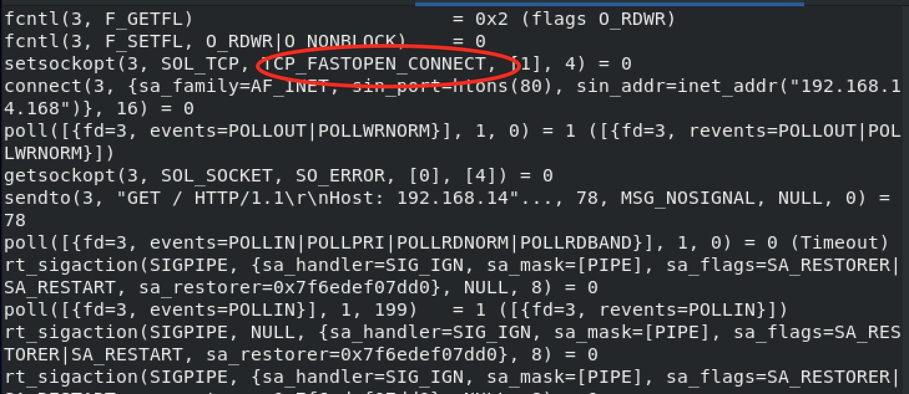
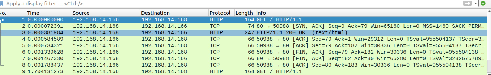
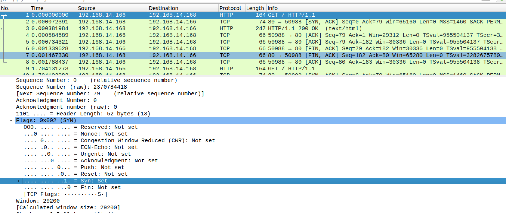
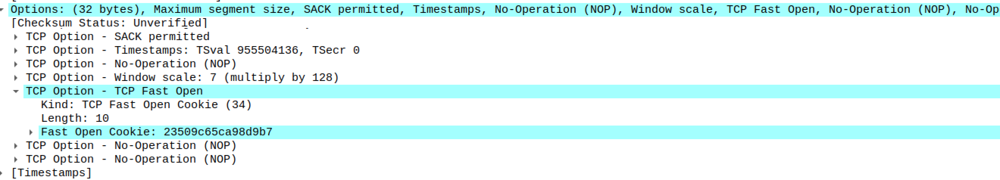

# 请求 `Fast Open Cookie` 的过程如下：

- 客户端发送一个 `SYN` 包，头部包含 `Fast Open` 选项，且该选项的 `Cookie` 为空，这表明客户端请求 `Fast Open Cookie`
- 服务端收取 `SYN` 包以后，生成一个 `cookie` 值（一串字符串）
- 服务端发送 `SYN` + `ACK` 包，在 `Options` 的 `Fast Open` 选项中设置 `cookie` 的值
- 客户端缓存服务端的 `IP` 和收到的 `cookie` 值
<!--more-->
第一次过后，客户端就有了缓存在本地的 `cookie` 值，后面的握手和数据传输过程如下：

- 客户端发送 `SYN` 数据包，里面包含数据和之前缓存在本地的 `Fast Open Cookie`。
- 服务端检验收到的 `TFO Cookie` 和传输的数据是否合法。
    - 如果合法就会返回 `SYN` + `ACK` 包进行确认并将数据包传递给应用层
    - 如果不合法就会丢弃数据包，走正常三次握手流程（只会确认 `SYN`）
- 服务端程序收到数据以后可以握手完成之前发送响应数据给客户端了
- 客户端发送 `ACK` 包，确认第二步的 `SYN` 包和数据（如果有的话）
后面的过程就跟非 `TFO` 连接过程一样了

我们看看 `curl` 如何支持 `fast open`, 通过 `strace` 抓下:

```shell
strace curl --tcp-fastopen http://192.168.14.168
```


我们看下在服务器的抓包信息:
## 第一次请求
`fast open cookie` 为空

## 第二次请求
第一个 `SYN` 包被识别成了 `HTTP` 请求




