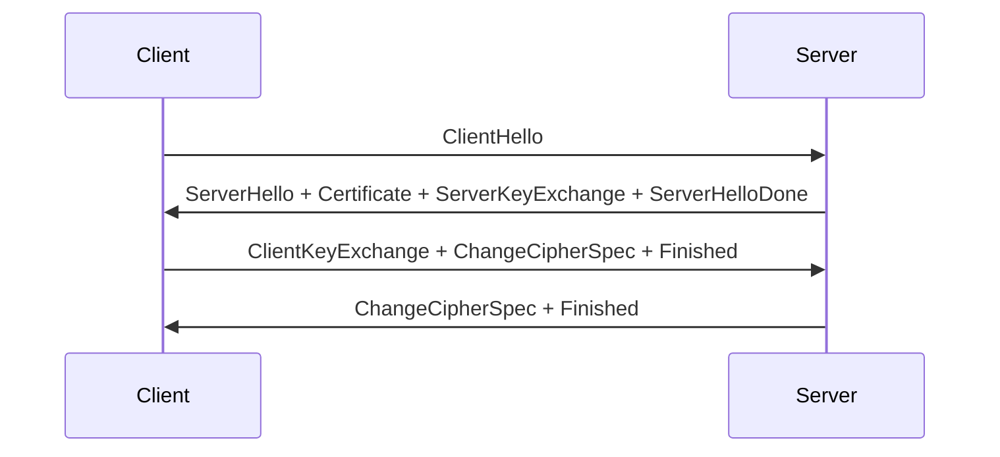
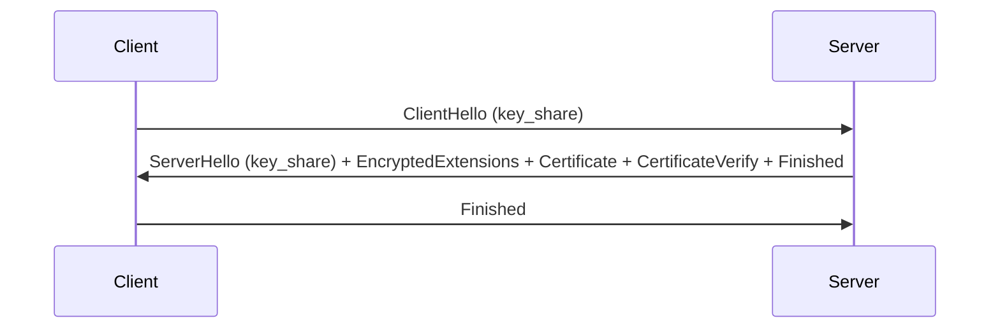

# TLS 1.2 与 TLS 1.3 握手流程深度解析：安全与性能的演进

## 引言

`TLS`（传输层安全协议）是互联网加密通信的基石。从 `TLS 1.2` 到 `TLS 1.3`，协议在安全性和性能上实现了质的飞跃。本文将深入对比两者的握手流程，解析其设计差异，并探讨为何 `TLS 1.3` 成为现代网络通信的首选。

---
<!--more-->
## `TLS 1.`2 握手流程（传统 `2-RTT` 模型）

### 1. **ClientHello**

- 客户端发送支持的协议版本（如 `TLS 1.2`）
- 随机数（`ClientRandom`）
- 密码套件列表（如 `TLS_ECDHE_RSA_WITH_AES_128_GCM_SHA256`）
- **其他扩展**：`SNI`（服务器名称指示）等。

### 2. **ServerHello**

- 服务器选择协议版本
- 随机数（`ServerRandom`）：`32` 字节的随机值。
- 选定的密码套件

### 3. **Certificate**

- 服务器发送证书链，用于身份验证。

### 4. **ServerKeyExchange**
- 传递临时密钥参数（如 `ECDHE` 公钥）。*（仅限非 RSA 密钥交换）*

### 5. **ServerHelloDone**

- 表示服务器消息结束。

### 6. **ClientKeyExchange**

- 客户端生成预主密钥（`Pre-Master Secret`），用服务器公钥加密后发送。*（若使用 RSA 密钥交换）*

### 7. **ChangeCipherSpec（客户端）**

- 通知服务器后续消息将加密。

### 8. **Finished（客户端）**

- 发送加密的 `HMAC` 验证握手完整性。

### 9. **ChangeCipherSpec（服务器）**

- 服务器切换至加密模式。

### 10. **Finished（服务器）**

- 服务器发送加密的 HMAC 验证。

**总耗时**：至少 **2 次往返（2-RTT）**。

---

## TLS 1.3 握手流程（1-RTT）

### 1. **ClientHello**

- **客户端**发起握手，发送以下内容：
    - **协议版本**：声明支持 `TLS 1.3`。
    - **随机数（`ClientRandom`）**：`32` 字节的随机值。
    - **密码套件列表**：支持的加密算法组合（如 `TLS_AES_128_GCM_SHA256`）。
    - **密钥共享扩展（`key_share`）**：包含客户端生成的临时公钥（如 `ECDHE` 的椭圆曲线公钥）。
    - **其他扩展**：如支持的签名算法、`SNI`（服务器名称指示）等。

- **密钥生成**：
    - 此时尚未生成密钥，消息以**明文**发送。

- **加密数据**：
    - 无加密，但包含后续密钥交换所需参数。

### 2. **ServerHello**

- **服务器**响应，内容包括：
    - **协议版本**：确认使用 `TLS 1.3`。
    - **随机数（`ServerRandom`）**：`32` 字节的随机值。
    - **选定的密码套件**：从客户端列表中选择的套件（如 `TLS_AES_128_GCM_SHA256`）。
    - **密钥共享扩展（`key_share`）**：服务器的临时公钥（如 `ECDHE` 的椭圆曲线公钥）。

- **密钥生成**：
    - 客户端和服务器通过 `ECDHE`（或其他密钥交换算法）计算共享密钥：
        - **共享密钥（Shared Secret）** = `ECDH(client_priv, server_pub) = ECDH(server_priv, client_pub)`。
        - 结合 `Client Random` 和 `Server Random`，通过 **HKDF** 生成：
            - **预主密钥（Pre-Master Secret）** → **主密钥（Master Secret）**。
            - 主密钥再派生出 **握手流量密钥（Handshake Traffic Keys）**。
- **加密数据**：
    - 无加密，`ServerHello` 仍为**明文**。

### 3. **服务器端后续消息（同一轮次发送）**

服务器发送以下消息，合并为单个 `TLS` 记录：

- **EncryptedExtensions**：可选扩展（如 `ALPN` 应用层协议协商, `SNI` 确认等）。
- **Certificate**：服务器证书链，用于身份验证。
- **CertificateVerify**：用服务器私钥对握手消息签名，证明拥有证书。
- **Finished**：加密的验证数据（`HMAC`），确保握手完整性。

### 4. **客户端验证与响应**

客户端：

- 验证服务器证书的有效性。
    - 检查证书颁发机构\有效期、域名匹配
    - 递归验证证书链至可信根`CA`（浏览器/`OS`内置）
    - 检查吊销状态（`OCSP`或`CRL`）
- 检查 `CertificateVerify` 签名是否正确。
- 发送 `Finished` 消息：加密的 `HMAC`，供服务器验证握手完整性。

**总耗时**：**1 次往返（1-RTT）**。

---

## 0-RTT 快速握手（提前发送数据）

**前提**：客户端与服务器已通过前一次握手生成预共享密钥（`PSK`）。

**流程**

1. `ClientHello`：包含 `pre_shared_key` 扩展（`PSK` 标识）和 `early_data` 扩展。
2. `ServerHello`：服务器接受 PSK，返回 `pre_shared_key` 确认。
3. 客户端立即发送 `0-RTT` 应用数据：使用 `PSK` 加密，无需等待握手完成。
4. 后续步骤与完整握手相同（服务器发送 `Finished`，客户端响应）。

**注意**：`0-RTT` 数据可能受**重放攻击**，需确保应用层操作是**幂等**的（如 `GET` 请求）。

---

## 关键差异对比

| **特性**               | **TLS 1.2**                | **TLS 1.3**                |
|-----------------------|---------------------------|---------------------------|
| **握手耗时**           | 2-RTT                     | 1-RTT（或 0-RTT）         |
| **密钥交换算法**       | 支持 RSA（非前向安全）     | 仅 ECDHE/DHE（强制前向安全）|
| **握手消息合并**       | 多步骤（如 ServerKeyExchange） | 合并至 ServerHello 后     |
| **0-RTT 支持**         | 不支持                    | 支持（基于 PSK）          |
| **不安全算法**         | 允许 SHA-1、RC4 等         | 完全移除                  |
| **会话恢复机制**       | Session ID 或 Session Ticket | 优先使用 PSK 和 Session Ticket |

---

## TLS 1.3 的核心改进

### 1. **前向安全（Forward Secrecy）**
- 强制使用临时密钥（`Ephemeral Key`），即使长期私钥泄露，历史会话也无法解密。

### 2. **0-RTT 快速握手**
- 基于预共享密钥（`PSK`），客户端首次请求即可携带加密数据（如 `HTTP` `GET`）。
- **注意**：`0-RTT` 数据需防重放攻击，仅限幂等操作。

### 3. **算法精简**
- 移除 `RSA` 密钥传输、`DES`、`RC4`、`SHA-1` 等弱算法，默认使用 `AEAD` 加密（如 `AES-GCM`）。

### 4. **握手消息加密**

- 除 `ClientHello/ServerHello` 外，其余消息（如证书）均加密传输，增强隐私性。

## TLS 1.2 与 TLS 1.3 握手流程图

### TLS 1.2 流程图（简化）

### TLS 1.3 流程图（1-RTT）

## 性能与安全对比

| **场景**               | **TLS 1.2**                  | **TLS 1.3**                  |
|-------------------------|------------------------------|------------------------------|
| **首次连接延迟**        | 高（2-RTT）                  | 低（1-RTT）                  |
| **重连延迟（会话恢复）**| 中（1-RTT）                  | 极低（0-RTT）                |
| **抗量子计算攻击**      | 弱                           | 更强（支持 X25519 等算法）   |
| **隐私保护**            | 部分握手消息明文传输         | 握手消息全加密               |

---

### 表格说明
1. **首次连接延迟**：
   - `TLS 1.3` 通过合并握手步骤减少往返次数，显著降低延迟。
   - `TLS 1.2` 需多次交互协商密钥，耗时更长。

2. **重连延迟**：
   - `TLS 1.3` 支持 0-RTT 快速恢复，客户端可立即发送加密数据。
   - `TLS 1.2` 需重新协商密钥，仍需 1-RTT。

3. **抗量子计算攻击**：
   - `TLS 1.3` 默认使用 `X25519` 等强临时密钥算法，安全性更高。
   - `TLS 1.2` 依赖传统算法（如 `RSA`），易受量子计算威胁。

4. **隐私保护**：
   - `TLS 1.3` 加密所有握手消息（除 `ClientHello/ServerHello`），防止中间人窃听敏感信息（如证书）。
   - `TLS 1.2` 的证书、`ServerKeyExchange` 等消息明文传输。

---

> **注**：TLS 1.3 的 0-RTT 模式需注意重放攻击风险，建议仅用于幂等操作（如 HTTP GET）。

---

## 何时选择 TLS 1.3？

- **推荐场景**：
    - 高延迟网络（如移动端）。
    - 需要前向安全的敏感数据传输。
    - 高频短连接（如 `API` 请求）。

- **注意事项**：
    - 部分旧设备可能不支持 `TLS 1.3`。
    - `0-RTT` 需应用层防御重放攻击。

---

## 总结

`TLS 1.3` 通过精简握手流程、强制前向安全和算法升级，显著提升了安全性与性能。尽管 `TLS 1.2`仍在某些旧系统中使用，但 `TLS 1.3` 已成为现代 `Web` 服务、移动应用和 `IoT` 通信的首选协议。升级至 `TLS 1.3` 不仅是技术趋势，更是安全实践的必然要求。

## 参考内容

- [The Transport Layer Security (TLS) Protocol Version 1.2](https://datatracker.ietf.org/doc/html/rfc5246)
- [The Transport Layer Security (TLS) Protocol Version 1.3](https://datatracker.ietf.org/doc/html/rfc8446)
- [tls13_key_schedule](https://gist.github.com/yngty/c81f1266ed300135346464c1b3b78913)
