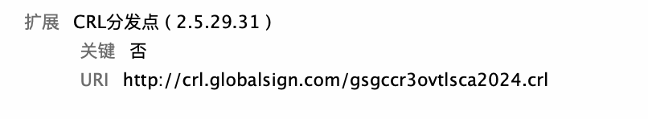
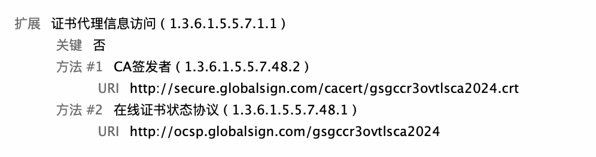

在 `HTTPS` 通信中，浏览器如何判断一个网页使用的证书是否已经 **吊销**（`Revoked`）？证书一旦吊销，就意味着它已不再可信，但如何通知用户浏览器，是一个非常关键的安全机制。

本篇文章将全面梳理浏览器判断证书吊销状态的几种主流机制，及其优缺点和实际表现。

<!-- more -->

## 一、为什么需要检查证书吊销？

证书可能因为以下原因被吊销：

- 私钥泄露
- CA 错误签发
- 域名所有权变更
- 签发策略违规

一旦证书被吊销，如果浏览器还继续信任它，就可能被中间人攻击。因此浏览器需要一种机制实时判断证书是否有效。

---

## 二、证书吊销检查的几种方式

### 1. CRL（Certificate Revocation List，证书吊销列表）

#### ✳️ 原理：
证书颁发机构（`CA`）会定期发布一个包含所有被吊销证书的列表（`CRL` 文件），用户可以下载这个列表来核查证书是否被吊销。

证书的 `CRL`信息
`CRL` 信息是 `CA` 在颁发证书时，写入在 `X.509 v` 的扩展区域的，比如`*.taobao.com` 的证书信息：

#### ✳️ 工作流程：

1. 浏览器从证书的 `CRL Distribution Point (CDP)` 字段中获取 `CRL` 的 `URL`。
2. 下载整个 `CRL` 文件。
3. 检查目标证书的序列号是否在 `CRL` 中。

#### ✳️ 优点：
- 标准机制，普遍支持。
- 完整信息，一次性可查多个吊销证书。

#### ✳️ 缺点：
- `CRL` 文件可能非常大（几十 `KB` 到几 `MB`）。
- 实时性差，依赖 `CA` 发布频率。
- 性能开销大，不适合实时在线检查。

---

### 2. OCSP（Online Certificate Status Protocol）

#### ✳️ 原理：

在 `RFC2560X.509 Internet Public Key Infrastructure Online Certificate Status Protocol – OCSP` 的描述中，浏览器从在线 `OCSP` 服务器（也称为 `OCSP Response Server`）请求证书的撤销状态，`OCSP Server`予以响应。这种方法避免 `CRL` 更新延迟问题。同样的，`X.509 v3`证书的 `OCSP`信息也是存储在拓展信息中，如 `*.taobao.com`:

`OCSP` 是一种「按需验证」机制。浏览器向 `CA` 的 `OCSP` 服务端查询某个特定证书的状态，并接收单独的响应结果。

#### ✳️ 工作流程：

1. 浏览器从证书的 `Authority Information Access (AIA)` 字段中读取 `OCSP URL`。
2. 发起一个 `HTTP` 请求，带上证书序列号。
3. `CA` 返回该证书的状态（`good` / `revoked` / `unknown`）。

#### ✳️ 优点：
- 实时响应，单证书验证。
- 网络传输小，适合动态检查。

#### ✳️ 缺点：
- 增加一次网络请求，影响性能。
- 如果 `OCSP` 服务不可用，有些浏览器会“软失败”继续加载页面，存在安全隐患。
- 请求`OCSP`服务器会暴露了用户的隐私，会暴露用户访问网站地址

#### ✳️ 各浏览器对 OCSP 的处理：

| 浏览器     | OCSP 默认开启 | OCSP 不可用时行为（软失败） |
|------------|----------------|------------------------------|
| Chrome     | 是             | 忽略错误，继续加载           |
| Firefox    | 是             | 用户可配置，默认软失败       |
| Safari     | 是             | 忽略错误，继续加载           |

---

### 3. OCSP Stapling（OCSP 装订）

#### ✳️ 原理：
为了减少 `OCSP` 查询的网络开销和隐私暴露，**由服务器** 主动向 `CA` 查询 `OCSP` 状态，并将结果“装订”在 `TLS` 握手过程中传给客户端。

#### ✳️ 工作流程：

1. 服务器启动时向 `CA `获取 `OCSP` 响应（通常缓存一天）。
2. 在 TLS 握手时通过 `CertificateStatus` 扩展字段返回给浏览器。
3. 浏览器无需额外查询，即可确认证书状态。

#### ✳️ 优点：
- 快速、高效、安全。
- 不暴露用户行为给 `CA`（提升隐私）。

#### ✳️ 缺点：
- 依赖服务器正确配置。
- 响应缓存失效后必须及时更新，否则浏览器可能拒绝连接。
- 同样有 `OCSP Response` 不可用的问题

---

### 4. 浏览器内置吊销列表（CRLSets / OneCRL）

#### ✳️ 原理：
为提升用户体验和避免实时验证失败，**浏览器厂商自己维护** 一份高风险吊销证书列表，定期推送更新到客户端。

- Chrome：使用 [CRLSets](https://dev.chromium.org/Home/chromium-security/crlsets)
- Firefox：使用 OneCRL（通过 Mozilla 远程更新系统分发）

#### ✳️ 特点：

- 快速、离线判断，不依赖网络。
- 只包含 **高风险证书**（如知名 CA 出错、重大漏洞曝光等）。
- 不全面，仅用于应急响应。

---

## 三、机制对比表

| 机制           | 实时性 | 依赖网络 | 浏览器支持 | 覆盖范围     | 安全性 |
|----------------|--------|----------|------------|--------------|--------|
| CRL            | ❌ 否   | ✅ 是     | ✅ 部分支持 | 全量（但慢） | 中     |
| OCSP           | ✅ 是   | ✅ 是     | ✅ 广泛支持 | 单证书实时   | 高     |
| OCSP Stapling  | ✅ 是   | ✅ 否     | ✅ 支持     | 单证书实时   | 高     |
| CRLSets/OneCRL | ✅ 是   | ❌ 否     | ✅ 内置支持 | 部分（高风险） | 高     |

---

## 四、实际体验与常见误区

- 浏览器默认策略通常是“软失败”——如果无法验证证书状态，就继续加载页面，以免用户体验受影响。
- 并非所有吊销都能立刻让用户看到红色警告，这取决于 CA、服务器配置和浏览器行为。
- Let's Encrypt 等证书广泛使用 OCSP Stapling，服务器配置错误可能导致吊销状态无法传播。

---

## 五、如何测试证书吊销？

如果你是开发者或安全研究者，可以通过以下方式测试吊销验证效果：

1. 使用 OpenSSL 生成证书并向测试 CA 申请签发。
2. 通过 OCSP 吊销该证书。
3. 在服务器启用 OCSP Stapling。
4. 用浏览器访问网页，观察是否提示错误。

或使用测试站点验证，如：

- [https://revoked.badssl.com/](https://revoked.badssl.com/)
- [https://ocsp-stapling-test.badssl.com/](https://ocsp-stapling-test.badssl.com/)

---

## 六、总结

现代浏览器采用多种机制判断网页证书是否被吊销，每种机制有不同的权衡。虽然 OCSP 是主流方式，但在性能、隐私和可靠性之间，需要结合 OCSP Stapling 和浏览器厂商的安全策略（如 CRLSets）才能实现更好的用户安全体验。

如你运营网站，推荐启用 **OCSP Stapling** 并定期检查配置是否正常，以提高安全性和性能。

---

> 📚 **参考资料**：
> - [你不在意的HTTPS证书吊销机制](https://www.anquanke.com/post/id/183339)
> - [RFC 5280 - X.509 Certificate and CRL Profile](https://datatracker.ietf.org/doc/html/rfc5280)
> - [Mozilla Security/CA Certificate Policy](https://wiki.mozilla.org/CA)
> - [CRLSets in Chromium](https://dev.chromium.org/Home/chromium-security/crlsets)
